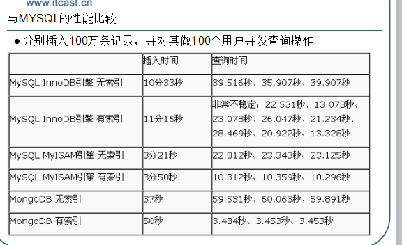
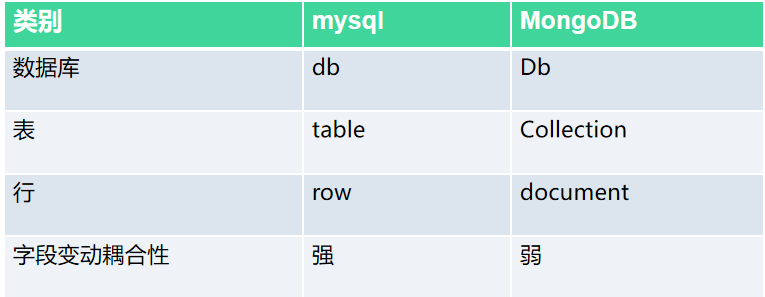
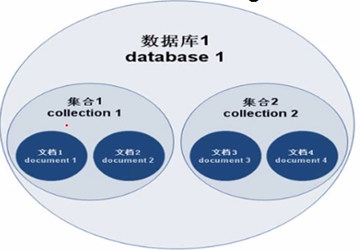

# MongoDB项目实战
#### 一.数据库分类
>1. 关系型数据库（SQL）
    >>MySQL、          Oracle 、        SQL Server  、       DB2

>2. 非关系型数据库（NOSQL）
    >>Redis   、        MongoDB   ..........

#### 二. MongoDB概念
    MongoDB是一款为web应用程序和互联网基础设施设计的数据库管理系统。
    MongoDB就是数据库(非关系型的数据库)，是NoSQL类型的数据库
#### 问题------->NoSQL是什么?
    NoSQL(NoSQL = Not Only SQL )，意即“不仅仅是SQL”。是非关系型数据存储的广义定义，
    通常以key-value形式存储数据，没有表结构。

    说明：“不仅仅是SQL”指不适用SQL语句的数据库.

#### 三. NoSQL产生背景
##### 1. 问题------->为什么会出现NoSQL？
    随着互联网web2.0网站的兴起，传统的关系数据库在应付web2.0网站，
    特别是超大规模和高并发的SNS类型的web2.0纯动态网站已经显得力不从心，
    暴露了很多难以克服的问题，而非关系型的数据库则由于其本身的特点得到了非常迅速的发展。
    NoSQL数据库的产生就是为了解决大规模数据集合多重数据种类带来的挑战，
    尤其是大数据应用难题，包括超大规模数据的存储。
##### 2. 大数据时代对数据仓库的要求
    高并发读写需求

    海量数据的高效率读写

    高扩展性和可用性
##### 3. NoSQL的优缺点
###### 优点
    a.易扩展(去掉关系数据库之间的数据关系,数据之间无关系,在架构层面也带了扩展能力).

    b.快速的读写(sql语句不用解析,功能相对单一)

    c.成本低廉(开源的软件)

    d.架构灵活,没有复杂的关系(表与表之间不存在关系)


###### 缺点
    a.没有统一的标准.

    b.没有正式的官方支持.

    c.支持的特性不够丰富,现有产品所提供的功能比较有限 
    不能像Mysql SQl Server和oricale一样,提供各种附加功能.
##### 4. MongoDB VS mysql




##### 5. MongoDB应用领域
    博客文章-评论系统
    记录日志
    缓存
    即时通信聊天记录
##### 6. MongoDB的存储方式
    mongodb是将数据存储到硬盘上.

    mongodb内部支持的js解释器,我们可以在mongodb中直接写js代码.

    mongodb存数据的时候是key->value形式:(js中的key-value就是对象{key:value})

    mongodb中分为数据库,集合(相当于mysql中的表),文档(相当于mysql的记录)


#### 四. MongoDB安装
#### 五. MongoDB 组成
    传统的关系型数据库一般是由数据库(database),表(tables),记录(record)三个层次的概念组成,

    Mongodb则是由数据库(database),集合(collection),文档对象(document)三个层次组成.

    Mongodb中的集合(相当于关系型数据库中的表)但是没有没有了表与表之间的关系,以及列和行的概念,这体现了其模式自由的特点.

    集合:即一组文档,多个文档存放在一起即变成集合,类似于mysql中的表.

    数据库:多个集合组合在一起即变成数据库.



#### 六. MongoDB操作
    在MongDB的安装路径下的Bin文件夹中打开CMD
    语法:mongo空格ip地址:端口号(mongodb的默认端口号为27017)/数据库名  (默认连接test)

#### 七. MongoDB操作数据库
库:
C:\MongoDB\bin>mongo 127.0.0.1:27017
>查看当前数据库
>>\>show dbs

>增加/切换数据库
>>\>use [db名称]

>删除数据库
>>\>use [db名称]
>>\>db.dropDatabase() //注意大写

集合:
>查看数据库当中的集合
>>\>show collections;

>创建collection
>>\>db.[collection名称].insert({json数据});   创建添加数据
>>\>db.createCollection([collection名称]);   只创建


>删除集合
>>\> db.[collection名称].drop()

>查看数据库当中的集合
>>\>show collections;

##### MongoDB操作数据文档-添加

插入数据:

    >db.COLLECTION_NAME.insert( {"key":"val",`````} )

    插入记录成功之后,mongodb会默认为每一个文档都添加一个_id的字段,
    并且 同一集合中的_id是唯一的,该字段可以是任意数据类型,默认的为objectId

    思考？-----：_id是否可以自定义?
        在插入的时候手工定义_id的值(值是唯一的)《是可以自定义的》


    插入：
    >db.COLLECTION_NAME.save(document)

###### save和insert有什么区别呢？
    insert: 若新增数据的主键已经存在，则会抛异常提示主键重复，不保存当前数据。
    save: 若新增数据的主键已经存在，则会对当前已经存在的数据进行修改操作。
##### 批量插入数据语句
    >db.COLLECTION_NAME.insert([document1,document2,document3])


##### MongoDB文档管理-查询
    查询数据库语句:
    
    db.[collection名称].find();//查询集合中所有的记录

    db.[collection名称].find().pretty();//格式化查询使得查询出来的数据在命令行中更加美观的显示(有显示格式的优化)，不至于太紧凑


# Mongoose 与 Node 操纵 Mongodb数据库

#### Mongoose简介
    mongoose是nodeJS提供连接 mongodb的一个库,

    便捷操作MongoDB的对象模型工具(Mongoose的操作是以对象为单位的)

#### Mongoose 操作 Mongdb
##### 1. 驱动下载
    npm install mongoose --save
##### 2. 连接Mongdb
```js
//链接数据库使用解析器来解析本次连接
mongoose.connect("mongodb://localhost:27017/连接的(库)",{ useNewUrlParser: true,useUnifiedTopology:true })
var db=mongoose.connection;//设置数据库链接对象
// 监听成功失败
db.on("err",console.error.bind(console,"aaa"));
db.on("open",()=>{
    console.log("链接成功")
})	

```
##### 3. 创建schema对象：mongoose操作数据库都是通过schema对象
```js
定义文档构成（类似创建数据库表字段方便添加内容的时候使用）

var userSchema= new mongoose.Schema({
    行名:数据类型,//内容与数据类型
    行名:{type:Number,default:默认值}，
    行名:{type:String,required:true 不能为空}
})
```
##### 4. Schema对象转换成数据模型
    注意mongoose会默认给我们的集合名末尾加个s或者我们手动加个s

    var colUser=mongoose.model("集合名",创建的schema对象);

##### 5. 插入
    设置插入内容
    var demoUser = new colUser(
        key:"val",
        key:”val”
    })

    插入使用save()进行插入
##### 5. 查询
    使用find()进行查询操作
    查询全部：

    查询指定内容


#### Mongoose 与 Node 操纵 Mongodb数据库--------------示例

在server.js中创建后端
```js
let express = require("express");
let app = express();

let showR = require("./router/showrouter");//进入路由模块
let addR = require("./router/addrouter");

app.use("/show",showR); //使用中间件
app.use("/add",addR);

app.listen(8888,(err,res)=>{  //监听
    if(err){
        console.log(err)
    }else{
        console.log("---------------------")
    }
})
```
2.创建db数据库文件夹，在其下的index.js中开启连接数据库
```js
//1.引用mongoose
let mongoose = require("mongoose");

//2.设置连接参数 connect()
mongoose.connect("mongodb://localhost:27017/2006",{ useNewUrlParser: true,useUnifiedTopology: true  })

//3.开始连接
let db = mongoose.connection;

//4.监听连接成功与失败
db.on("err",console.error.bind(console,"连接失败"))
db.on("open",()=>{
    console.log("连接成功")
})

//设置数据库连接文档对象
let schema = new mongoose.Schema({
    name:String
})

//设置集合
let coluser = mongoose.model("aas",schema)
module.exports = coluser;
```


3.创建router文件夹，在其下的添加数据的路由(addrouter)中 -------<添加>
```js
let express = require("express");
let router = express.Router();

//引入数据库连接模块
let coluser = require("../db")

router.get("/addone",(req,res)=>{   //添加
    //1.设置插入数据
    let docu = new coluser({
        name:"小可爱"
    })

    //2.开始插入
    docu.save().then(res=>{
        console.log(res)
    }).catch(err=>{
        console.log(err)
    })   
})
module.exports = router;
```
3.创建router文件夹，在其下的添加数据的路由(showrouter)中  -------<查询>
```js
let express = require("express");
let router = express.Router();

let coluser = require("../db") //进入数据库连接模块

router.get("/showone",(req,res)=>{ 
   coluser.find().then(ok=>{     //查询
        res.send({status:200,cc:"我是查询的数据哦",data:ok})
        console.log(res)
   }).catch(err=>{
       console.log(err)
   })
})

module.exports = router;
```


## robo 3t
    robo 3t是一款MongoDB的辅助工具，可以帮助您在管理数据库内容方面提供一定的开发优
    化方案，内置一个代码编辑区域，您可以将数据库文件放到软件上修改，结合图形化的处理
    方式，可以将MongoDB数据库中的文件转换为分布式的存储方式，提高数据文件编辑和保存效率。

