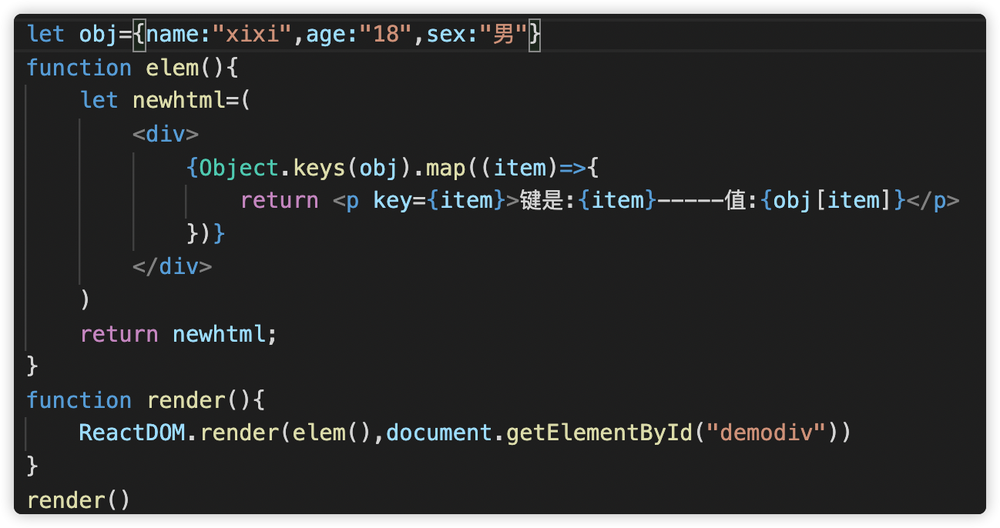
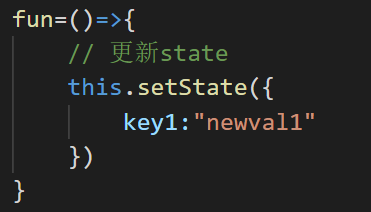

# React

##### npm 改为淘宝下载东西：
```js
全局安装nrm: npm i -g nrm

nrm use taobao    (切换到淘宝)

nrm ls  (展示)

nrm use npm   (再重新回到npm)
```


##### 什么是 React ?
    React 起源于 Facebook 

    React 是一个用于构建用户界面的 javascript 库。

    React 拥有较高的性能，代码逻辑非常简单，越来越多的人已开始关注和使用它。
##### 虚拟Dom------*快减少更新次数  减少更新区域*
    虚拟dom相当于在js和真实dom中间加了一个缓存。基于
    React进行开发时所有的DOM构造都是通过虚拟DOM进行，每
    当数据变化时，React都首先重新构建整个DOM树（减少页面
    更新次数），然后React将当前整个DOM树和上一次的DOM树
    进行对比(DOM Diff算法-最小化页面重绘)，得到DOM结构的
    区别，然后仅仅将需要变化的部分进行实际的浏览器DOM更新。
##### 为什么虚拟 dom 会提高性能?(重要)
    虚拟 dom 相当于在 js 和真实 dom 中间加了一个缓存，利
    用 dom diff 算法避免了没有必要的 dom 操作，从而提高性能。

    用 JavaScript 对象结构表示 DOM 树的结构；然后用这个
    树构建一个真正的 DOM 树，插到文档当中当状态变更的时
    候，重新构造一棵新的对象树。然后用新的树和旧的树进行
    比较，记录两棵树差异把 2 所记录的差异应用到步骤 1 所
    构建的真正的 DOM 树上，视图就更新了
##### diff算法的作用
    计算出虚拟DOM中真正变化的部分，并只针对该部分进行原生DOM操作，
    而非重新渲染整个页面。

##### React的diff算法
    **什么是调和？
        将Virtual(虚拟)DOM树转换成actual(真实)DOM树的最少操作的过程称为调和 。

    **什么是React diff算法？
        diff算法是调和的具体实现。
##### React 特点
    声明式设计 −React采用声明范式，可以轻松描述应用。
    （开发者只需要声明显示内容，react就会自动完成）

    高效 −React通过对DOM的模拟，最大限度地减少与DOM的交互。

    灵活 −React可以与已知的库或框架很好地配合。

    组件 − 通过 React 构建组件，使得代码更加容易得到复
    用，能够很好的应用在大项目的开发中。（把页面的功能拆分成小模块--每个小模块就是组件）

    单向数据流--　React是单向数据流，数据主要从父节点传递
    到子节点（通过props）。如果顶层（父级）的某个props改
    变了，React会重渲染所有的子节点

##### React 组件特性
    React的核心就是组件：组件的设计目的是提高代码复用率，降低测试难度和代码的复杂程度。

    提高代码复用率：组件将数据和逻辑进行封装。

    降低测试难度：组件高内聚低耦合（各个元素高集成度低关联性），很容易对单个组件进行测试。

    代码的复杂程度：直观的语法，可以极大提高可读性。

##### React 浏览器兼容性
    除去ie8以下版本，其余浏览器都可以很好的支持
##### React 依赖包下载
    react核心包：   npm install react --save
    react-dom：    npm install react-dom --save
    babel包：      npm install babel-standalone --save

##### React --根DOM节点
    页面中需要有一个div容器，容器中的内容都会被React Dom所管理。
    这个容器叫做根DOM节点

    注意：通常React 开发应用时一般只会定义一个根节点。
#### React --JSX
    JSX=javascript xml就是Javascript和XML结合的一种格式。
    是JavaScript 的语法扩展。 React推荐在 React 中使用 JSX 来描述用户界面。
    当遇到<，JSX就当HTML解析，遇到{就当JavaScript解析。

##### jsx优点：

    JSX 执行更快，因为它在编译为 JavaScript 代码后进行了优化。

    它是类型安全的，在编译过程中就能发现错误。

    使用 JSX 编写模板更加简单快速。
#### React 开发环境搭建
    编写React渲染组件ReactDOM.render()

    ReactDOM.render 是 React 的最基本方法，用于将模板转
    为 HTML 语言，并插入页面指定的 根DOM 节点。


##### 注释
    注释/*内容*/  
    html标签内注释｛ /* 最外层有花括号*/ ｝
##### 写--------多行HTML
    多个 HTML 标签，需要使用一个 父 元素包裹
    使用圆括号包裹养成好习惯


##### JSX独立文件使用
> React JSX 代码可以放在一个独立文件上创建一个 demoreact.js 文件
>>
> 页面中引用注意script中的type属性
>>

#### JSX表达式
逻辑判断 - 三目运算 :
>>
渲染数组 :
>>

##### JSX绑定属性
    Jsx中也可以使用大括号来定义以 JavaScript 表达式为值的属性：

    
	
	切记使用了大括号包裹的 JavaScript 表达式时就不
    要再到外面套引号了。JSX 会将引号当中的内容识别
    为字符串而不是表达式。
##### 定义样式 : 
    定义样式对象, 以style属性引用一个对象
    样式名以驼峰命名法表示, 如text-align需写成textAlign
    默认像素单位是 px
>>

    引用外部样式 : 

        引用外部样式时, 不要使用class作为属性名, 因为class是js的保留关键
        字。JSX 语法上更接近 JavaScript 而不是 HTML，所以 React DOM 使
        用 className（小驼峰命名）来定义属性的名称，而不使用 HTML 属性名称的命名约定。

##### jsx规则扩展：
1.html的value属性要写成：defaultValue
2.html的checked属性要写成：defaultChecked
3.style 里面写对象
4.class 写className

### React列表
##### React 列表渲染
    在实际应用中 数据展示 是最基本的功能。
    React中使用的map（）进行列表的渲染

>>

其他循环方式
>>
>>

##### React扩展知识--如何让render重新渲染
完成点击变色的demo
>>

##### js知识点回顾--对象如何取值
对象取值有两种方式 1.用点的方式 2.用[]来取值
>>
>> 在实际项目中一般使用点，会方便许多，但是如果key是变量的话就不能使用点了，js会理解变量为对象的key值，造成混淆
    object.keys()返回一个数组类型 值是方法中对象的键（key）

    Object.values()返回一个数组类型 值是方法中对象的值（value）

    Object.entries()返回一个数组类型 值是方法中对象的键和值
##### React 遍历对象

>>

### 面向组件编程
##### 组件基本概念
    组件是React中非常重要的概念--是可以将UI切分成
    一些独立的、可复用的部件，这样你就只需专注于构建每一个单独的部件。
##### 定义自定义组件--1.函数组件/无状态组件
    组件 首字母大写并且其后每个字母首字母大写
>>

##### 定义父子组件
    通过创建多个组件来合成一个组件，即把组件的不同功能点进行分离。
>>

##### 定义组件--2.ES6 class类组件
    需要注意类名的首字母必须大写
    一个组件类必须必须必须要实现一个 render 方法。这个方法必须要返回一个jsx元素。
    必须要用一个外层的jsx元素把所有的内容包裹起来，返回并列的多个元素需要有个父元素包裹
```js
class MyCom extends React.Component{
    render(){
        return <div>我是组件</div>
    }
}
```
#### props
##### 组件 : Props传入参数
    props 是组件对外的接口。使用props就可以从外部向组件内部进
    行数据传递 完成父组件传值给子组件

    注意：Props对于使用它的组件来说，是只读的。一旦赋值不能修
    改。也就是说props的值是不可变的只能在渲染的时候传入无法动态赋值。

    组件无论是使用无状态组件还是通过 类组件声明，都决不能修改自身的 props。

>当一个组件被注入Props 值时，属性值来源于它的父级元素，从父级到子元素。
>>>


>在参数较多的时候可以把**Object类型**进行传递
>>>

##### 组件 : Props默认值
> 用 **||** 来进行判断 高版本有**兼容性**
>>>

##### 组件 : Props默认值-defaultProps
> 有些时候, 我们需要设置一些默认属性, 在父级
组件未向子级组件传递数据时, 填充默认值。**defaultProps**
>>>

##### Props 验证
>15.5之前Props 验证使用 propTypes，它可以保证我们在应用组件的时候可以正确的传递值
>>>

    新版验证方式--注意要引用 prop-types 库

    npm install --save prop-types

>

##### 组件--class类定义方式 : 传入参数
>使用this.props.xx   接收值
>

##### 组件--class类定义方式 : defaultProps: 设置默认属性
>类方式创建使用defaultPropos进行默认值设置两种方式
>

### State 状态机
    在react中开发者只需要关心数据。数据改变页面就会发生改变

    数据等同于状态。状态改变-页面绑定的数据就由react进行改变

    组件被称之为“状态机”，视图与状态一一对应

##### 使用--初始化状态

>使用状态必须先初始化：this.state={}
>

##### constructor--super
    ES6的继承规则得知，不管子类写不写constructor，
    在new实例的过程都会给补上constructor。

    可以不写constructor，一旦写了constructor，
    就必须在此函数中写super()super调用父类的构造
    方法,此时组件才有自己的this，在组件的全局中都可以使用this关键字，

    否则如果只是constructor 而不执行 super() 那么以后的this都是错的！！！
    super()继承父组件的 this

super(props)

    当想在constructor中使用this.props的时候，super需要加入(props)，

    此时用props也行，用this.props也行，他俩都是一个东西。
    （不过props可以是任意参数，this.props是固定写法）
##### 读取状态  ------this.state.key1
##### 更新状态
    更新状态---》组件界面更新：this.setState({})
    小知识：setState()是异步的会自动触发render函数的重新渲染
>

State--完整使用
>

>如果想看到修改后的值 就在setState回调中查看
>

##### 扩展---插入字符串标签
>使用react给我们提供的方法
**dangerouslySetInnerHTML = {{ __html:你要插入的字符串 }}**
>
```js
class Mdiv extends React.Component{
        constructor(){
            super()
            this.state={
                aa:"<h3>我是h3</h3>"   //定义
            }
        }
        render(){
            return(
                <div dangerouslySetInnerHTML={{__html:this.state.aa}}>  //使用

                </div>
            )
        }
}
ReactDOM.render(<Mdiv />,document.getElementById("box"))
```


#### Refs 转发
    React提供的这个ref属性(不能在无状态组件上使
    用 ref 属性，因为它们没有实例)表示为对组件真
    正实例的引用其实就是ReactDOM.render()返回的组件实例

    ReactDOM.render()渲染组件时返回的是组件实例；
    而渲染dom元素时，返回是具体的dom节点。

    一句话总结： 标识组件内部的元素
    
##### ref属性--使用
    React的ref有3种用法：

    1. 字符串(官方不推荐使用)
    2. 回调函数（官方推荐）
    3. React.createRef() （React16.3新提供）

---
    最早的ref用法。使用this.refs.xxx来进行访问
>
    回调函数就是在dom节点或组件上挂载函数，函数的入参是dom节点，
    达到的效果与字符串形式是一样的，都是获取其引用。
>
    在React 16.3版本后，使用此方法来创建ref。将其赋
    值给一个变量，通过ref挂载在dom节点或组件上该ref
    的current属性将能拿到dom节点或组件的实例

>

##### 版本历史
>


##### this指向
```js
class MyCom extends React.Component{
    constructor(props){
        super(props)
        this.state={
            text:"dddd"
        }
        this.fund=this.fund.bind(this)    // 提前给函数绑定this
    }   
    fun=()=>{              // 方式2：通过创建箭头函数
        this.setState({
            text:"heheda"
        })
    }
    funb(){  }   // 方式1：通过bind方法进行原地绑定，从而改变this指向
    func(){  } // 方式4：将事件调用的写法改为箭头函数的形式    
    fund(){  } // 方式3：在constructor中提前对事件进行绑定

    render(){
        return(
            <div>
                <h1>this指向</h1>
                <p>{this.state.text}</p>
                <button onClick=  { this.funb.bind(this) }  >点我</button>  //方式1：通过bind方法进行原地绑定，从而改变this指向
                <button onClick=  { this.fun }  >点我</button>             //方式2：通过创建箭头函数
                <button onClick=  { this.fund }  >点我</button>            //方式3：在constructor中提前对事件进行绑定
                <button onClick= { ()=>{this.func()} } >点我</button>   //方式4：将事件调用的写法改为箭头函数的形式
            </div>
        )
    }
}
ReactDOM.render(<MyCom/>,document.querySelector("#demodiv"))

```
##### 事件处理---修改this指向（面试常问）
    方式1：通过bind方法进行原地绑定，从而改变this指向

    方式2：通过创建箭头函数

    方式3：在constructor中提前对事件进行绑定

    方式4：将事件调用的写法改为箭头函数的形式


#### React组件生命周期
    每个组件都包含“生命周期方法”，可以重写这些方法，
    以便于在运行过程中特定的阶段执行这些方法

    React 生命周期分为三种状态：

        挂载阶段
        更新阶段
        卸载阶段
##### React 生命周期--挂载阶段
```js
**constructor()**中完成了React数据的初始化，

**componentWillMount()**一般用的比较少，它更多的是在服务端渲染时使用。
它代表的过程是组件已经经历了constructor()初始化数据后，但是还未渲染DOM时。

**componentDidMount()**组件第一次渲染完成，此时dom节点已经生成，
可以在这里调用ajax请求，返回数据setState后组件会重新渲染

**componentWillUnmount**在组件从 DOM 中移除之前立刻被调用。

            ReactDOM.unmountComponentAtNode(document.getElementById("demodiv"));//卸载组件
```

##### React 生命周期--更新阶段
```js
**componentWillReceiveProps (nextProps)**
在组件接收到一个新的prop时被调用。

**shouldComponentUpdate** 判定组件是否要更新html 
主要用于性能优化(部分更新)唯一用于控制组件重新渲染的生命周期，
由于在react中，setState以后，state发生变化，组件会进入重新渲染的流程，
在这里return false可以阻止组件的更新

**componentWillUpdate（）**
组件即将更新html时候调用shouldComponentUpdate返回true以后，
组件进入重新渲染的流程

**componentDidUpdate** 在组件完成更新后立即调用。
render（）函数会插入jsx生成的dom结构，react会生成一份虚拟dom树，
在每一次组件更新时，在此react会通过其diff算法比较更新前后的新旧DOM树，
比较以后，找到最小的有差异的DOM节点，并重新渲染。

```
##### React 生命周期纵览
```html
生命周期的方法有：

componentWillMount 组件渲染之前调用
componentDidMount  组件渲染之后调用在第一次渲染后调用
componentWillReceiveProps在组件接收到一个新的prop时被调用。这个方法在初始化render时不会被调用。
shouldComponentUpdate 判定组件是否要更新html
componentWillUpdate组件即将更新html时候调用
componentDidUpdate 在组件完成更新后立即调用。
componentWillUnmount在组件从 DOM 中移除之前立刻被调用。   

     ReactDOM.unmountComponentAtNode(document.getElementById("demodiv"));//卸载组件

```
#### React事件处理
    React事件绑定属性的命名采用小驼峰式写法。

    绑定函数的过程中不加() 否则函数会立即执行

    React中阻止默认行为使用preventDefault()；

##### 事件处理---传递参数
方式1（推荐）：通过 bind 的方式进行传递
>

方式2：通过箭头函数传递。注意使用箭头函数调用事件对象必须显式的进行传递
>

#### React条件渲染
    React 中的条件渲染和 JavaScript 中的一致，使用 JavaScript 
    操作符 if 或条件运算符来创建表示当前状态的元素，
    然后让 React 根据它们来更新 UI。
##### 条件渲染-if 语句
    在React中使用if语句条件渲染是最简单的，但是注意jsx中不允许有if
>

##### React状态提升
    React中的状态提升概括来说,就是多个组件需要反映相同的变化数据，
    提升到它们最近的父组件上.在父组件上改变这个状态然后通过props分发给子组件.

    状态提升也就是：
    两个子组件需要利用到对方的状态的话，那么这个时候我们就需要使用到状态提升

##### todolist
添加展示
>
删除展示
>
修改展示
>

### React应用-脚手架

##### React脚手架使用
```js
create-react-app安装:

npm install -g create-react-app 安装脚手架

create-react-app --version 查看版本
 
create-react-app 项目名  创建项目

cd 项目名 切换到创建好的项目中

npm start 启动运行

```

#### React脚手架使用-传递值
##### 1. 使用props传递值--------(正向传值)
>
>

##### 2. 逆向传值---函数传值
>

##### 3. 同级传值---pubsub-js
>同级传值使用pubsub-js
下载 npm install --save pubsub-js
在第一个组件中进行数据抛出 PubSub.publish("事件名","数据")
>>
>在第二个组件中接收
 PubSub.subscribe("监听的事件",(事件,数据)=>{})
>>

##### 4. 跨组件传值context

     react 组件间传递数据是通过 props 向下，是单向传递的，从父级一层一层地通
     过 props 地向下传递到子子孙孙，有的时候我们组件一层一层的嵌套多层，这样这
     种方式一层一层传递麻烦，如果想跃层传递，这就会用到 context。

    context：上下文对象

    context很好的解决了跨组件传值的复杂度。可以快速的进行跨组件数据的传递。

    想要使用context进行跨组件传值那么就要使用createContext()方法同时方法中给我们提供了两个对象：

    Provider对象      生产者---->用来生产数据
    Consumer对象   消费者---->用来使用数据


>在src下创建文件(index.js)与文件夹(context)用来容纳context对象
创建内容并且引用createContext对象
>>

>如果需要传递多个值那么就传递一个对象
>>

>在根组件(index.js)中使用   
 (包裹根组件成为所有组件的父级组件)
 创建Provider生产者与Consumer消费者对象并且创建数据
>>


>在需要的组件中进行使用
>>


##### this.props.children
    this.props对象的属性与组件的属性是一一对应的，但是有一个例外
    就是this.props.children属性，它表示组件的所有子节点

    this.props.children的值有三种可能：
    1.如果当前组件没有子节点，它就是undefined;
    2.如果有一个子节点，数据类型是Object;
    3.如果有多个子节点，数据类型就是array。

    使用this.props.children就可以得到组件的所有子节点

    当然其中也可以传入组件使用this.props.children也可以得到
>>
>>
---
    处理多个子节点
        如果有多个子节点可以使用React 提供一个工具方法 React.Children 来处理
        React.Children中包含了等方法来对子节点进行处理
>>


##### React扩展知识--强制刷新
    forceUpdate()就是重新调用render渲染。
    有些变量不在state上，当时你又想达到这个变量更新的时候，刷新render；
>>


## ReactAjax
    ajax可以放在 componentDidMount方法中的代码，是在组件已经完全挂载到网页上才会调用被执行，
    所以可以保证数据的加载。此外，在这方法中调用setState方法，会触发重新渲染。
    所以，官方设计这个方法就是用来加载外部数据用的

    在react16.0以后，componentWillMount可能会被执行多次。所以最好不要在此钩子中请求


    React本身没有独有的获取数据的方式。(使用原生或者第三方的方式)

    React 组件的数据可以通过 componentDidMount 方法中的 Ajax 来获取，
    当从服务端获取数据时可以将数据存储在 state 中，再用 this.setState 方法重新渲染 UI。

##### 常用的ajax请求库
    jQuery 比较重，需要外部引用不建议使用
    axios 轻量级，建议使用
    fetch 原生函数，但老版本浏览器不支持


##### axios拦截器
```js
在util工具文件夹中创建request.js文件用来编写拦截器。

import axios from "axios"
// 创建axios 赋值给常量service 
const service = axios.create();

// 添加请求拦截器（Interceptors）
service.interceptors.request.use(function (config) {
    // 发送请求之前做写什么
    return config;
  }, function (error) {
    // 请求错误的时候做些什么
    return Promise.reject(error);
  });

// 添加响应拦截器
service.interceptors.response.use(function (response) {
    // 对响应数据做点什么
    return response;
  }, function (error) {
    // 对响应错误做点什么
    return Promise.reject(error);
  });
  export default service

```

##### 跨域

```js
正向代理配置--可以请求中国天气网http://www.weather.com.cn/data/cityinfo/101320101.html

1.找到项目目录下/node_modules/react-scripts/config/webpackDevServer.config.js

2.然后在其中找到proxy 并修改成如下：
proxy:{
        "/api（可以随便写）":{
             target:"请求地址",
             changeOrigin:true,
             "pathRewrite":{
               "^/api（和上面一样）":"/"
        }
} 
3.并修改请求地址
```
##### 弹射
    刚才在解决跨域的时候配置文件隐藏过深非常麻烦。

    使用弹射（把配置文件设置根目录中来）eject

    eject 操作是不可逆的，执行之后会把所有细节都暴露在我们面前，让项目目录变得很庞大。所以不要一上项目就弹射


    如果想修改 在项目目录执行：npm run eject

    注意可能会报错
###### 报错解决
    执行npm run eject报错如上，应该是没装好git，或者装了但是没提交到仓库

    先执行   git add .

    后执行   git commit -m "自己的提交信息"

    在运行   npm run eject


    或者：把node_modules删除了  重新npm install

## 路由
    根据不同的url 来切换对应的组件

    实现spa（单页面应用）应用：
    整个项目只有一个完整页面
    页面切换不会刷新页面（不会感觉页面的闪烁 更加贴近原声应用的体验）
#### 路由-分类
    1. React-Router：提供了一些router的核心API，
    包括Router, Route, Switch等，
    但是它没有提供 DOM 操作进行跳转的API。

    ****2. React-Router-DOM：提供了 BrowserRouter, Route, Link等 API,
    我们可以通过 DOM 的事件控制路由。
    例如点击一个按钮进行跳转，大多数情况下我们是这种情况，
    所以在开发过程中，我们更多是使用React-Router-DOM。
#### 路由模式-HashRouter 和 BrowserRouter
    HashRouter （hash模式）
    url中会有个#，例如localhost:3000/#，HashRouter就会出现这种情况，
    它是通过hash值来对路由进行控制。如果你使用HashRouter，你的路由就会默认有这个#。
    刷新不会丢失

    BrowserRouter（历史记录模式 ） 
    是通过历史记录api来进行路由的切换的很多情况下
    我们则不是这种情况，我们不需要这个#，因为它看起来很怪，
    这时我们就需要用到BrowserRouter。
    刷新会丢失404（上线中会出现问题  本地开发中不会）
#### 路由-link与switch
    Link 主要API是to，to可以接受string或者一个object，来控制url。

    NavLink 它可以为当前选中的路由设置类名、样式以及回调函数等
    to属性跳转路径*activeClassName*当元素处于活动状态时应用于元素的样式

#### 路由基本使用
```js
路由最基本的职责就是当页面的访问地址与 Route 上的 path 匹配时，就渲染出对应的 UI 界面。

1.下载路由模块
npm install --save react-router-dom

2.在index.js引用路由模块 
import { BrowserRouter} from 'react-router-dom';

ReactDOM.render(
  <BrowserRouter>
    <Index />
  </BrowserRouter>,
  document.getElementById('root')
);

3.在index.js使用路由模式包裹跟组件

4.在home.js中引用路由出口

import {Route} from "react-router-dom"

5.配置 
<Route path="/路径" component={组件}/>

```
router->index------(配置路由)
```js
import React, { Component } from 'react'
import {Route, Switch, Redirect } from 'react-router-dom'  /* 引入路由规则兼出口 */

import Home from '../views/home'     /* 引入各组件 */
import About from '../views/about'
import News from '../views/news'
import Wode from '../views/wode'
import No from '../views/no'
import Bottombar from '../components/bottombar'

export default class index extends Component {
    render() {
        return (
            <div>
                <Bottombar/>

                {/* 配置路由规则 */}
                <Switch>  {/* switch唯一渲染  当匹配到指定的路由的时候就会停止向下渲染 */}
                    {/* <Route exact path="/" component={Home}/> */}
                    <Redirect from="/" to="/home" exact/>    {/* exact代表当前路由path的路径采用精确匹配 */}
                    <Route  path="/home" component={Home}/>
                    <Route path="/about" component={About}/>
                    <Route path="/news" component={News}/>
                    <Route path="/wode/:ping" component={Wode}/>
                    <Route  component={No}/>                      {/* 404页面 */}
                </Switch>
            </div>
        )
    }
}
```
##### 路由导航
    使用Link组件即可 to属性就是地址
```js
import React, { Component } from 'react'
import { Link, NavLink, withRouter } from 'react-router-dom'
import './bottombar.css'

 class bottombar extends Component {
    fun(path){                        /* 编程式导航*/
        this.props.history.push(path)
    }
    render() {
        return (
            <div>
            /* 声明式导航<Link> */
               <Link to="/home">home</Link> |    
               <Link to="/about">about</Link> | 
               <Link to="/news">news</Link> | 
               <Link to="/wode">wode</Link> 
               <hr/>
            /* 声明式导航<NavLink> */
               <NavLink to="/home" activeClassName="navS">home</NavLink> | 
               <NavLink to="/about" activeClassName="navS">about</NavLink> | 
               <NavLink to="/news/era" activeClassName="navS">news</NavLink> | 
               <NavLink to="/wode/我是params声明式" activeClassName="navS">wode</NavLink> 
               <hr/>
            /* 编程式导航*/
               <button onClick={this.fun.bind(this,"/home")}>home</button>
               <button onClick={this.fun.bind(this,"/about")}>about</button>
               <button onClick={this.fun.bind(this,"/news")}>news</button>
               <button onClick={this.fun.bind(this,"/wode")}>wode</button>
            </div>
        )
    }
}
export default withRouter(bottombar)  
```

##### 路由导航--NavLink
```js
导入NavLink：import { NavLink } from 'react-router-dom'

如果不喜欢默认的类名active 可以手动设置选中Class方便样式设置：

<NavLink to="/home" activeClassName="navS">home</NavLink>

**注意：如果在vscode的终端中启动项目可能会无效 在外部cmd中启动
```
##### exact 属性
    exact代表当前路由path的路径采用精确匹配，
    比如说Home的path如果不加上exact,那么path="/about"将会匹配他自己与path="/“这两个，
    所以一般path=”/"这个路由一般会加上exact，
    另外需要注意一点的是嵌套路由不要加exact属性，如果父级路由加上，
    这里例如topics加上该属性，他下面的子路由将不会生效，因为外层强制匹配了。
>

##### 路由--404页面
    有的时候用户可能会错误修改相关url 但是并没有相关路由 
    解决方式设置404路由组件 但是有问题不管到那个页面都会有这个404路由组件
##### \<Switch\>
    为了解决route的唯一渲染，它是为了保证路由只渲染一个路径。

    <Switch>是唯一的，因为它仅仅只会渲染一个路径，当它匹配完一个路径后，就会停止渲染了。

##### 路由--重定向
```js
导入Redirect:
    import { BrowserRouter,Route,Link,NavLink,Redirect } from 'react-router-dom'

定义重定向路径:  <Redirect from="/" to="/demoa" exact/>
```
>

##### 二级路由-------------(在一级路由的页面中配置)
    在子页面中引用路由模块:
    import {Route,Link} from 'react-router-dom';

    2.设置相关规则 与路由导航
>


##### 路由--js跳转
    replace() 替换当前路径

    goBack()后退

    goForward()前进

>push方法在路由页面中跳转 this.props.history.push("/xxxx")
>


##### 路由--withRouter
    withRouter作用是让不是路由切换的组件也具有路由切换组件的三个属性(location match history)

    withTouter 让不是理由所跳转的页面也具有路由的三个属性

#### 路由---传参params方式
>

    优势 ： 刷新地址栏，参数依然存在

    缺点 ： 只能传字符串，并且，如果传的值太多的话，url会变得长而丑陋。

#### 路由---传参state
```js
在Link中设置发送的数据:
    <Link to={{ pathname : '/d' , state: { name : 'sunny' }}}>  点我去d  </Link>

在需要接受的路由组建中接受:
    console.log(this.props.location. state.name)

```
    优势：传参优雅地址栏不显示传递的数据，传递参数可传对象；

    缺点：刷新地址栏，参数丢失
#### 路由render渲染写法
```js
修改Route 里面的组件调用方式为:
render={(props)=>{return <组件/>}}
render调用一个函数那么我们就可以决定什么时候渲染他 
同时传入props那么就可以在路由组件中使用history: {…}, location: {…}, match: {…}这几个对象
```
>

###### 路由render渲染写法传递数据
>

### redux
##### redux是什么
    Redux是为javascript应用程序提供一个状态管理工具

    集中的管理react中多个组件的状态

    redux是专门作状态管理的js库（不是react插件库可以用在其他js框架中例如vue，但是基本用在react中）
##### 什么时候用redux
    需求场景：
        某个组件的状态需要共享的时候
        某个组件的状态需要在任何地方都可以拿到
        一个组件需要改变全局状态
        一个组件需要改变另一个组件的状态
##### redux三大原则
    单一数据源:整个应用的 state 被储存在一棵 object tree 中，
    并且这个 object tree 只存在于唯一一个 store 中

    State 是只读的:唯一改变 state 的方法就是触发 action，
    action 是一个用于描述已发生事件的普通对象。

    使用纯函数来执行修改:为了描述 action 如何改变 state tree ，
    你需要编写 reducers(一些纯函数，它接收先前的 state 和 action，)
##### redux常用概念
    Store：管理着整个应用的状态，可以通过getState()来重新获得最新的状态(state)。

    Action：是唯一可以改变状态(state)的方式，服务器的各种推送、用户自己做的一些操作，
    最终都会转换成一个个的Action，而且这些Action就是修改的动作，可以通过dispatch()方法来进行调用

    Reducer：Reducer 是一个纯函数，它接受 Action 和当前 State 作为参数，
    返回一个新的 State。（纯函数就是只要传入相同的参数，每次都应返回相同的结果）。
##### redux常用方法
    createStore（）作用：创建一个Redux store来存放应用中所有的state，一个应用只能有个store。函数返回store对象。

    getState()作用：获取数据

    dispatch()分发action，这是改变state的唯一方法。

    subscribe()添加一个变化监听器，每当改变store的时候就会执行

##### 使用
    下载：npm install --save redux

    建议：在项目中创建一个sotre文件夹用来保存与redux相关的内容
##### redux初体验
>
###### redux组件中使用
>读取数据
>

>redux 修改数据
>在reducer中添加action任务
>