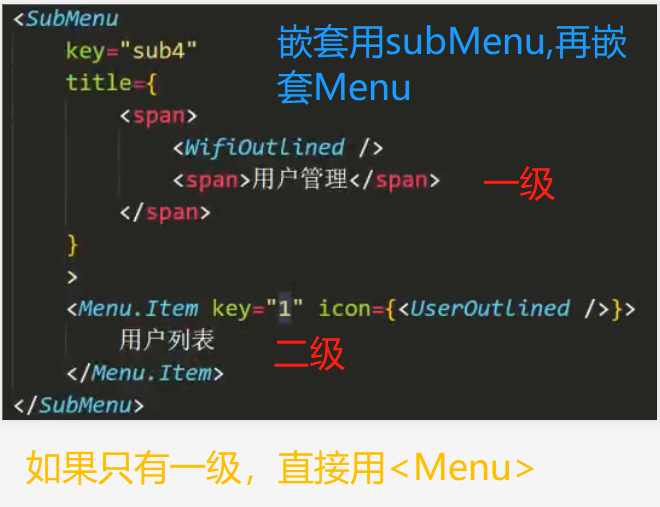
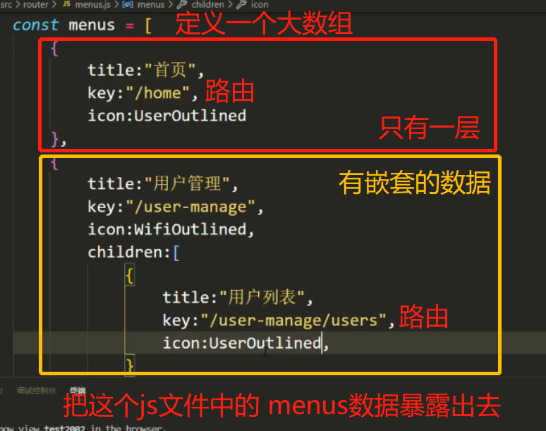
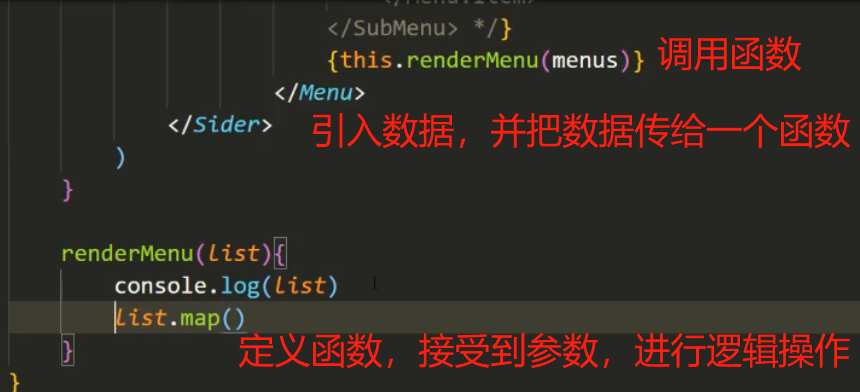
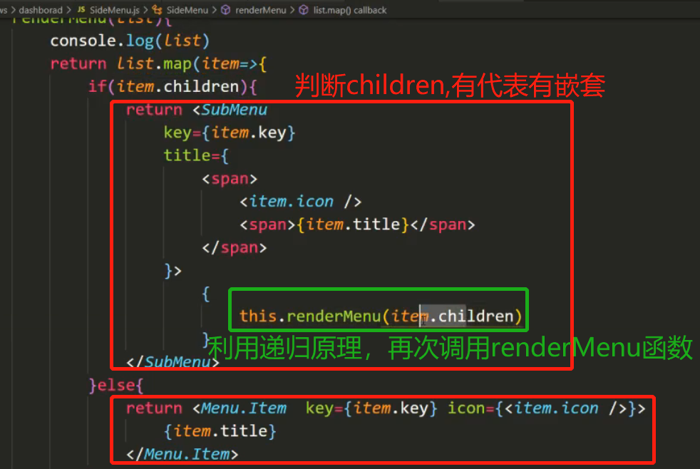
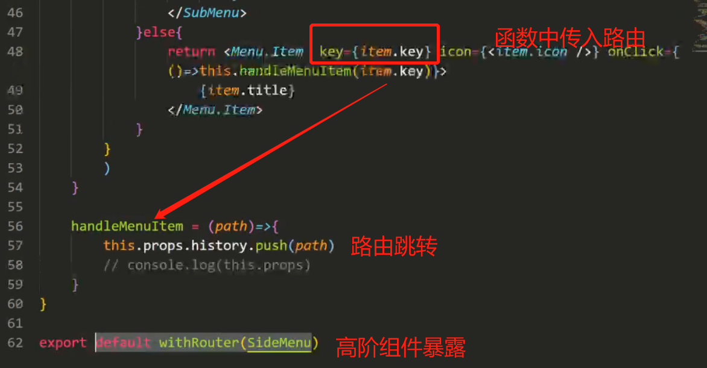

### 动态创建navbar
最初的样式---(用ant-design)

结构

创建navbar的动态数据，在js文件中，并将数据暴露出去

在将渲染的逻辑封装成一个函数，直接在渲染的地方调用函数

    map()循环遍历接受到的数据,判断每条数据中是否存在children

    如果有代表有嵌套列表，返回\<SubMenu>,然后继续判断嵌套中是否还存在children-----
    (这可以利用递归的原理再次调用renderMenu()函数)

    如果没有代表只有自己，返回一个\<Menu>

路由跳转

