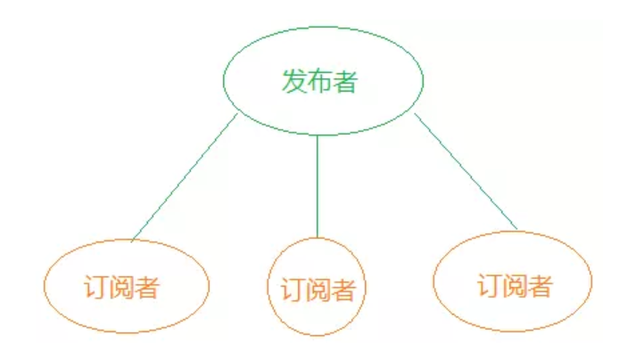
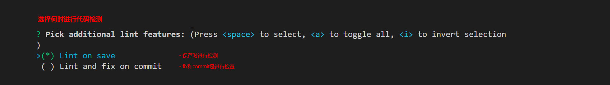
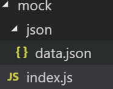
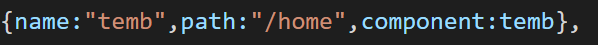
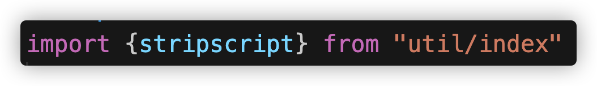
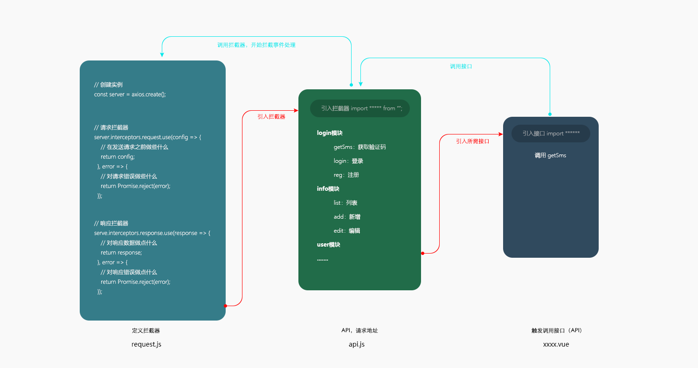
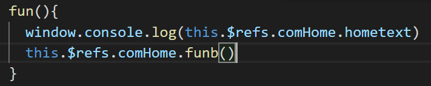

# Vue
> Vue.js是目前最流行的前端MVVM框架

> 作者：尤雨溪 ( 华人 )   前Google员工

##### 是一套构建用户界面的渐进式的自底向上增量开发MVVM框架，Vue 的核心库只关注视图层，它不仅易于上手，还便于与第三方库或既有项目整合。通过尽可能简单的 API 实现响应的数据绑定和组合的视图组件


 
##### Vue是一套渐进式框架的理解

    每个框架都会有自己的一些特点，会对开发者有一定的要求，这些要求就是主张，主张有强有弱，它的强势程度会影响在业务开发中的使用方式。

    可以在原有大系统的上面，把一两个组件改用vue实现，也可以整个用vue全家桶开发不会做职责之外的事

##### 对于Vue自底向上增量开发的设计的理解
    先写一个基础的页面，把基础的东西写好，再逐一去添加功能和效果，由简单到繁琐的这么一个过程。

#### Vue.js 目的
##### Vue.js的产生核心是为了解决如下三个问题
    1.解决数据绑定问题。

    2.Vue.js主要的目的是为了开发大型单页面应用。

    3.支持组件化，也就是可以把页面封装成为若干个组件，把组件进行拼装，这样是让页面的复用性达到最高。

##### vue.js的核心思想
    vue.js的核心思想包括：数据驱动和组件化。

##### Vue.js 优势
    简洁：HTML 模板 + Vue 实例 + JSON 数据

    轻量：17kb，性能好

    设计思想：视图与数据分离，无需操作DOM

    社区：大量的中文资料和开源案例

### MVC 框架
##### 什么是框架
    封装与业务无关的重复代码，形成框架

#####  框架的优势
    使用框架提升开发效率（虽然使用框架要遵循框架的语法但是使用框架可以大大提高对于业务逻辑的操作）

##### MVC - 表示软件可分成三部分
    模型（Model）数据的储存和处理，再传递给视图层相应或者展示

    视图（View）前端的数据展示

    控制器（Controller）对数据的接收和触发事件的接收和传递

##### 为什么要使用 MVC
    MVC 是一种专注业务逻辑，而非显示的设计思想

    MVC 中没有DOM操作
    
    将数据独立出来，方便管理

    业务逻辑、数据、界面显示分离的方法组织代码，将业务逻辑聚集到一个部件里面，在改进和个性化定制界面及用户交互的同时，不需要重新编写业务逻辑。

### MVVM思想

    Vue.js是一套构建用户界面的MVVM框架

    MVVM分为三个部分：分别是M（Model，模型层 ），V（View，视图层），VM（ViewModel，V与M连接的桥梁，也可以看作为控制器MVC的C层）

    1、 M：模型层，主要负责业务数据相关；

    2、 V：视图层，顾名思义，负责视图相关，细分下来就是html+css层；

    3、 VM：V与M沟通的桥梁，负责监听M或者V的修改，是实现MVVM双向绑定的要点；因此开发者只需关注业务逻辑，不需要手动操作DOM, 不需要关注数据状态的同步问题，复杂的数据状态维护完全由 MVVM 来统一管理。

1. MVVM思想关系图
<!--  -->


#### Vue声明式渲染
    Vue.js 的核心是一个允许采用简洁的模板语法来声明式的将数据渲染进 DOM，也就是将模板中的文本数据写进DOM中

    命令式渲染 ： 命令我们的程序去做什么，程序就会跟着你的命令去一步一步执行

    声明式渲染 ： 我们只需要告诉程序我们想要什么效果，其他的交给程序来做。

#### Vue数据驱动
    通过控制数据的变化来显示vue的数据驱动是视图的内容随着数据的改变而改变
<!--  -->


#### Vue渲染方式
> {{}}--表达式 --------  双大括号语法-------也叫模板语法
>> 将双大括号中的数据替换成对应属性值进行响应式的展示
>> 
<!-- >>  -->

## Vue.js 指令
#### 什么是 Vue.js 指令
    指令是带有 v- 前缀的特殊属性
<!--  -->
 
 ---

####  Vue.js 指令的用途
    它们作用于HTML元素，指令提供了一些特殊的特性，将指令绑定在元素上时，指令会为绑定的目标元素添加一些特殊的行为，我们可以将指令看作特殊的HTML属性（attribute）。
#### Vue.js 指令的书写规范
    书写位置：任意 HTML 元素的开始标签内

    注意：一个开始标签内可写入多个指令，多个指令间使用空格分隔
#### 常见指令
##### v-model 指令: 表单上数据的双向绑定
```js
<body>   
    <!-- 作用：主要是用于表单上数据的双向绑定
         语法：v-model = 变量 -->
    <div id="box">
        <!-- 双向数据绑定就是:视图的数据发生改变  模型也发生改变,模型改变了,视图也随之发生改变 -->
        <input type="text" v-model="hello">
        <h3>{{hello}}</h3>
        
        <!-- 绑定到复选框上 会把数据修改成布尔值 -->
        <input type="checkbox" v-model="cb">
        <h3>{{cb}}</h3>       
    </div>

    <script>
        new Vue({
            el:'#box',
            data:{
                hello:'hahaha',
                cb:'checkedbox'
            }
        })
    </script>
</body>
```
    作用：主要是用于表单上数据的双向绑定

    语法：v-model = 变量

        注：v-model 指令必须绑定在表单元素上
---

    双向绑定
        Vue框架核心的功能就是双向的数据绑定。 双向是指：HTML标签数据 绑定到 Vue对象，另外反方向数据也是绑定的
        使用 v-model 指令来实现双向数据绑定 把视图数据与模型数据相互绑定

        双向绑定--原理数据劫持
            vue数据双向绑定是通过数据劫持结合发布者-订阅者模式的方式来实现的
            数据劫持:当我们访问或设置对象的属性的时候，都会触发Object.defineProperty()函数来拦截（劫持），然后在返回(get)或设置(set)对象的属性的值。并且当数据发生改变的时候做出反应。

<!--  -->


> 双向绑定--原理发布者-订阅者模式
>> vue数据双向绑定是通过数据劫持结合发布者-订阅者模式的方式来实现的

>>发布者-订阅者模式:其定义对象间一种一对多的依赖关系，当一个对象的状态发生改变时，所有依赖于它的对象都将得到通知。

<!--  -->


##### v-show 指令:元素的显示和隐藏
    作用：控制切换一个元素的显示和隐藏

    语法：v-show = 表达式

        根据表达式结果的真假，确定是否显示当前元素

        true表示显示该元素；false(默认)表示隐藏该元素

        元素一直存在只是被动态设置了display：none

```js
<body>
    <div id="box">
        <!-- v-show 控制元素的显示或者隐藏  true显示 false隐藏 -->
        <!-- 注意  v-show  隐藏元素是通过display来设置的隐藏 -->

        <input type="checkbox" v-model="bool"><span>{{bool?'显示':'隐藏'}}</span>
        <div v-show="bool">{{h}}</div>
    </div>

    <script>
        new Vue({
            el:'#box',
            data:{
                h:'显示和隐藏',
                bool:true,
            }
        })
    </script>
</body>
```

##### v-on 指令:元素绑定事件
    作用：为 HTML 元素绑定事件监听

    语法：v-on：事件名称=‘函数名称()’

    简写语法：@事件名称=‘函数名称()’

        注：函数定义在 methods 配置项中

```html
<body>
    <div id="box">
        <!-- v-on指令  绑定事件 -->
        <button v-on:click="fn()">点击</button>
        <!-- @是简写的写法 -->
        <button @click="fn()">点击</button>
    </div>

    <script>
        new Vue({
            el:'#box',
            data:{            
            },
            methods:{
                fn(){
                    alert(11)
                }
            }
        })
    </script>
</body>
```
##### v-for 指令: 遍历data中的数据
    作用：遍历 data 中的数据，并在页面进行数据展示

    语法：v-for = ‘(item, index) in arr’

        item 表示每次遍历得到的元素

        index 表示item的索引，可选参数

```js
<body>
    <div id="box">
       <div>
           <p v-for="(v,i) in arr"> {{v}},{{i}}</p>
       </div>  
        <table border="1">
            <tr v-for="(v,i) in obj">
                <td>{{v.name}}</td>
                <td>{{v.age}}</td>
            </tr>
        </table>                                                                                                                   
    </div>
    <script>
        new Vue({
            el:'#box',
            data:{
                arr:['safa','dds','dsd'],
                obj:[
                    {name:"小明1",age:223},
                    {name:"小明2",age:223},
                    {name:"小明3",age:223},
                    {name:"小明4",age:223}
                ]
            }
        })
    </script>
</body>
```

##### v-bind 指令: 绑定HTML元素的属性
    作用：绑定 HTML 元素的属性

    语法：v-bind:属性名 = ‘表达式’/ 简写     ：属性名=‘表达式’

        绑定一个属性：

        绑定多个属性(不能使用简写)：

        

```html
<body>
    <div id="box">
        <!-- v-bind 给html的属性插入变量 -->
        <a v-bind:href="ahref">{{f}}</a>
         <!-- v-bind简写 -->
        <a :href="ahref">{{f}}</a>
        <h3 v-on:click="fn()" v-bind:class="bool?'color':''">点击变色</h3>
    </div>

    <script>
        new Vue({
            el:'#box',
            data:{
                f:'百度',
                ahref:'http://www.baidu.com',
                bool:true,
            },
            methods:{
                fn(){
                   this.bool = !this.bool;
                }
            }
        })
    </script>
</body>
```
##### v-if指令
    作用：判断是否加载固定的内容

    语法：v-if = 表达式

        根据表达式结果的真假，确定是否显示当前元素

        true表示加载该元素；false表示不加载该元素

        元素的显示和隐藏 是对Dom元素进行添加和删除

##### v-show与v-if区别：
>v-if有更高的切换消耗（安全性高）。
v-show有更高的初始化的渲染消耗（对安全性无要求选择）


##### v-else 指令
>作用：必须配合v-if使用否则无效。当v-if条件不成立的时候执行

##### v-else-if 指令
>作用：当有一项成立时执行。

```js
<div id="box">
        <input type="checkbox" v-model="bool">
        <div v-if="bool">登录了</div>
        <div v-else>没有登录</div>

        <select v-model="selectData">
            <option value="吃吃">吃吃</option>
            <option value="睡睡">睡睡</option>
            <option value="玩玩">玩玩</option>
        </select>

        <p v-if="selectData=='吃吃'">吃吃</p>
        <p v-else-if="selectData=='睡睡'">睡睡</p>
        <p v-else-if="selectData=='玩玩'">玩玩</p>
        <p v-else>什么都没选</p>
    </div>
    <script>
        new Vue({
            el:'#box',
            data:{
                bool:true,
                selectData:'',
            }
        })
    </script>
```

##### v-text 指令
>作用：操作网页元素中的纯文本内容。{{}}是他的另外一种写法

```js
<div id="box" v-cloak>
        <h3>{{hh}}</h3>
        <h3 v-text="hh"></h3>   //v-text 指令
    </div>
    <script>
        new Vue({
            el:'#box',
            data:{
               hh:'vdshdfbhfdkb' 
            }
        })
    </script>
```

##### v-text与{{}}区别
    v-text与{{}}等价，{{}}叫模板插值，v-text叫指令。

    有一点区别就是，在渲染的数据比较多的时候，可能会把大括号显示出来，俗称屏幕闪动：

1. 解决闪烁
```html
为了解决这种问题，可以采用以下两种方式：
①使用v-text渲染数据

②使用{{}}语法渲染数据，但是同时使用v-cloak指令（用来保持在元素上直到关联实例结束时候进行编译），v-cloak要放在什么位置呢，
  v-cloak并不需要添加到每个标签，只要在el挂载的标签上添加就可以

```
```js
<div id="box" v-cloak>  //v-cloak并不需要添加到每个标签，只要在el挂载的标签上添加就可以
    <h3>{{hh}}</h3>
</div>


<style>
    [v-cloak]{
        display: none;
    }
</style>
```

##### v-html  指令
    作用：双大括号会将数据解释为纯文本，而非 HTML 。为了输出真正的 HTML ，你需要使用 v-html 指令

    语法：<p v-html="text"></p>

```js
    //v-html  把字符串的html 编译成DOM 
    <div id="box">    
        <div v-html='a'></div>
    </div>

    <script>
        new Vue({
            el:'#box',
            data:{
              a:"<a href='http://www.baidu.com'>点我去百度</a>"
            }
        })
    </script>
```
#####  v-once  指令
    作用：当数据改变时，插值处的内容不会更新(会影响到该节点上的所有属性)

    v-once: 只渲染一次

    语法：<p v-once>{{text}}</p>
---
#### 指令小结
##### 1. v-show：控制切换一个元素的显示和隐藏
##### 2. v-on：为 HTML 元素绑定事件监听
##### 3. v-model：将用户的输入同步到视图上
##### 4. v-for ：遍历 data 中的数据，并在页面进行数据展示
##### 5. v-bind：绑定 HTML 元素的属性
##### 6. v-if: 判断是否加载固定的内容
##### 7. v-else: 当v-if条件不成立的时候执行
##### 8. v-else-if: 当有一项成立时执行。
##### 9. v-text: 操作网页元素中的纯文本内容
##### 10. v-html : 输出真正的 HTML
##### 11. v-once: 
----
### watch 监听
    watch:书写位置   与el data methods 同级位置
    
    可以监听模型数据,当模型数据改变的时候就会触发

    watch:{
        监听的data数据(newval,oldval){
            console.log(newval,oldval)
            //newval :新值    oldval: 原值
        }
    }

    watch初始化的时候不会运行,只有数据被改变之后才会运行
##### 什么时候使用watch
    当需要在数据变化时执行异步或开销较大的操作时，watch这个方式是最有用的。

    计算属性与侦听器的区别：

    当watch监听的值发生改变就会被调用，watch可以在数据变化时做一些异步处理或者开销大的操作
    计算属性是计算依赖的值，当依赖的值发生改变才会触发。

---
### 交互
##### 交互的应用场景（什么时候用到前后端交互）
    从后端获取一些数据，将其进行展示或计算
    将用户在页面中提交的数据发送给后端

### Vue请求数据交互
    vue请求数据有Vue-resource、Axios、fetch三种方式。
    Vue-resource是Vue官方提供的插件，
    axios是第三方插件，
    fetch es6原生

#### Vue.js resource交互 2.0停止更新了
    Vue自身不带处理HTTP请求 如果想使用HTTP请求必须要引入 vue-resource.js 库
    它可以通过XMLHttpRequest发起请求并处理响应。
    也就是说，$.ajax能做的事情，vue-resource插件一样也能做到，而且vue-resource的API更为简洁。
    Vue.js 交互借助于 $http 完成 

    下载：npm install --save vue-resource

```js
get 类型：
    语法：this.$http.get("url",     //请求地址（字符串）
        {params: {key1:val1,key2:val2…}}).    //参数列表
        then(function(res){处理请求成功的情况},     //请求成功
        function(res){处理请求失败的情况})      //请求失败

``` 
```js
POST类型:
    语法：this.$http.post("url",
        {key1:val1,key2:val2…},
        {emulateJSON:true}).             //模拟json格式，传递参数
        then(function(res){处理请求成功的情况},
        function(res){处理请求失败的情况})

```
#### Axios
    Axios是第三方插件，不仅能在Vue里使用，还能再其他第三方库中使用例如react

    npm install  --save axios

```js
get类型:
    语法：  axios.get('/路径?k=v&k=v}
            .then((ok)=>{})
            .catch((err)=>{})

```
```js
post类型:
    语法：axios.post('/user', {k:v,k:v })
        .then(function (ok) { })
        .catch(function (error) { });


```
##### Axios--post交互

    数据请求不到？
    试一试用jquery请求看看 发现是可以发送post数据的
    问题就在传参方式上面。
    需要使用URLSearchParams对象修改操作 URL传递参数的方法。
---
    实例化对象： 
    let param = new URLSearchParams();
    添加发送数据参数
    param.append("key", "value");


##### Axios--综合交互
    axios(utl:'请求地址',method:'请求方式',data/params:{k:v}).then((ok)=>{})
    使用get发送数据的时候 使用params：{key:val}发送数据
    使用post发送数据需要使用 var param=new URLSearchParams();修改传参方法
    使用param.append("uname","xixi")添加数据并且使用data发送数据


```js
 methods:{
        sendBtn(){      //点击发送请求
            this.bool=true;
            this.axiosurl("").then((res)=>{
                console.log(res)
                this.arr = res.data.data.commentList;
                this.bool=false;
            }).catch((rev)=>{
                console.log(err)
            })
        },
        axiosurl(url){       //封装axios
            return new Promise((resovle,reject)=>{
                axios({
                    url,
                    method:"get"
                }).then((res)=>{
                    resovle(res)
                }).catch((err)=>{
                    reject(err)
                })
            })
        }
},
```

### 过滤器
##### 过滤器

    过滤器作用:
        在不改变数据的情况下，输出前端需要的格式数据
        2.0中已经废弃了内置过滤器，需要我们自定义过滤器来使用filter 
##### 全局过滤器的定义方法
```js
位置：创建实例之前

Vue.filter("过滤器名字", function(val){
    return val.substr(1,2)
});

```
##### Vue.js 局部过滤器
```js
只能在当前vue注册内容中使用
在vue实例中与el属性data属性同级定义

filters：{
    过滤器名字(val){
        return 输出内容
    }
}
```
```js
过滤器的调用方法：
    {{ msg | 过滤器名字 }} 

注意事项：
    定义全局过滤器，必须放在Vue实例化前面
    在没有冲突的前提下，过滤器可以串联
```
示例
```js
<ul>
    <li v-for="(v,i) in arr">{{v|过滤器名字}}</li>
</ul>

//
new Vue({
            el:"#box",
            data:{
                arr:[1,3,4,5,7,7,5,4,4,9]
            },
            filters:{
                过滤器名字(val){
                   return val>5?'大于5':'小于5';
                }
            }
})
```
---
### 事件对象
    【扩展】事件对象
        语法：<div @click=‘fn($event)’></div>中，$event为事件对象

        作用：记录事件相关的信息

```html
<input type="text" @keydown.ctrl="fun($event)">

methods:{ 
    fun(e){
        console.log(e.keyCode)
    }
}
```
##### 事件修饰符
    【扩展】事件修饰符
        概念：v-on指令提供了事件修饰符来处理DOM事件细节
        按键修饰符： .up, .down, .ctrl, .enter, .space等等
        语法：@click.修饰符='fn()'
---
    【扩展】事件修饰符
        prevent修饰符：阻止事件的默认行为(submit提交表单)
        stop修饰符：阻止事件冒泡
        capture修饰符：与事件冒泡的方向相反，事件捕获由外到内
        self：只会触发自己范围内的事件，不包含子元素
        once：只会触发一次
        注意：修饰符可以串联使用
### 计算属性
计算属性:  就是vue实例中一个有计算data数据功能的属性
##### 概念：
```html
顾名思义，首先它是一种属性，其次它有“计算”这个特殊性质。
每次取得它的值得时候，它并不像普通属性那样直接返回结果，而是经过一系列的计算之后再返回结果。
同时只要在它的当中里引用了 data 中的某个属性，当这个属性发生变化时，
计算属性仿佛可以嗅探到这个变化，并自动重新执行。

```
##### 为什么要用计算属性
    模板内的表达式非常便利，但是设计它们的初衷是用于简单运算的。
    在模板中放入太多的逻辑会让模板过重且难以维护	
    例：
        <p>{{text.toUpperCase().substr(2,1)}}</p>
##### 计算属性--语法
```js
computed: {
    需要返回的数据(){
        return 处理操作
    }
}
```
##### 计算属性 VS 方法
用(计算属性)和(方法)改造:把数据转大写并且截取的例子
```js
//计算属性
computed:{
    xt(){
        return  this.text.toUpperCase().substr(2,1);
    }
}

//方法
methods:{
    textfun(){
        return this.text.toUpperCase().substr(2,2)
    }
}
```
    计算属性是基于它们的依赖进行缓存的。计算属性只有在它的相关依赖发生改变时才会重新求值。
    方法绑定数据只要被调用，方法将总会再次执行函数。
    计算属性相对于方法在处理特定场合下节省资源性能

     计算属性与方法有什么区别用一句话来解释:  就是计算属性有缓存, 方法没有 所以计算属性对性能的消耗更低

### 实例生命周期
##### 1.什么是实例的生命周期
    实例在创建到销毁经过的一系列过程叫生命周期 
##### 2.什么是生命周期钩子
    在生命周期中被自动调用的函数叫做生命周期钩子	
##### 3.生命周期钩子函数的用途
    每个 Vue 实例在被创建时都要经过一系列的初始化过程——例如，
    需要设置数据监听、编译模板、将实例挂载到 DOM 并在数据变化时更新 DOM 等。
    同时在这个过程中也会运行一些叫做生命周期钩子的函数，
    这给了用户在不同阶段添加自己的代码的机会。
###### 3.1钩子函数有哪些
```html
beforeCreate（创建实例）、created（创建完成）、
beforeMount（开始创建模板）、mounted（创建完成）、
beforeUpdate（开始更新）、updated（更新完成）、
beforeDestroy（开始销毁）、destroyed（销毁完成）

钩子函数的书写位置在data与methods同级位置书写。
```
###### 3.2 设置数据请求的钩子
    created里面，如果涉及到需要页面加载完成之后的话就用 mounted。

    在created的时候，视图中的html并没有渲染出来，所以此时如果直接去操作html的dom节点，一定找不到相关的元素

    而在mounted中，由于此时html已经渲染出来了，所以可以直接操作dom节点
实例的生命周期—扩展常见问题
```html
1.什么是vue生命周期？ 

    Vue 实例从创建到销毁的过程，就是生命周期。也就是从开始创建、初始化数据、编译模板、
    挂载Dom→渲染、更新→渲染、卸载等一系列过程，我们称这是 Vue 的生命周期。

2.vue生命周期的作用是什么？

    生命周期中有多个事件钩子，让我们在控制整个Vue实例的过程时更容易完成指定逻辑

3.vue生命周期总共有几个阶段？

    它可以总共分为8个阶段：创建前/后, 载入前/后,更新前/后,销毁前/销毁后

4.第一次页面加载会触发哪几个钩子？

    第一次页面加载时会触发 beforeCreate, created, beforeMount, mounted 这几个钩子

5.DOM 渲染在 哪个周期中就已经完成？

    DOM 渲染在 mounted 中就已经完成了。

6.简单描述每个周期？

    beforeCreate（创建前） 在数据观测和初始化事件还未开始

    created（创建后） 完成数据观测，属性和方法的运算，初始化事件，实例中的el属性还没有显示出来

    beforeMount（载入前） 在挂载开始之前被调用，相关的render函数首次被调用。
    实例已完成以下的配置：编译模板，把data里面的数据和模板生成html。注意此时还没有挂载html到页面上。

    mounted（载入后） 在el 被新创建的 vue.el 替换，并挂载到实例上去之后调用。
    实例已完成以下的配置：用上面编译好的html内容替换el属性指向的DOM对象。
    完成模板中的html渲染到html页面中。此过程中进行ajax交互。

    beforeUpdate（更新前） 在数据更新之前调用，发生在虚拟DOM重新渲染和打补丁之前。
    可以在该钩子中进一步地更改状态，不会触发附加的重渲染过程。

    updated（更新后） 在由于数据更改导致的虚拟DOM重新渲染和打补丁之后调用。
    调用时，组件DOM已经更新，所以可以执行依赖于DOM的操作。
    然而在大多数情况下，应该避免在此期间更改状态，因为这可能会导致更新无限循环。
    该钩子在服务器端渲染期间不被调用。

    beforeDestroy（销毁前） 在实例销毁之前调用。实例仍然完全可用。

    destroyed（销毁后） 在实例销毁之后调用。
    调用后，所有的事件监听器会被移除，所有的子实例也会被销毁。
    该钩子在服务器端渲染期间不被调用。

```
## 组件
####  1.什么是组件
    组件即自定义控件，是Vue.js最强大的功能之一
#### 2.组件的用途：
    组件能够封装可重用代码，扩展HTML标签功能
#### 3.组件的本质
    自定义标签

#### 4.组件的分类
    全局组件
        作用域：不同作用域内均可使用

    局部组件
        作用域：只在定义该组件的作用域内可以使用
#### 5. 组件的类型
    1、页面级别的组件：页面级别的组件，通常是views目录下的.vue组件，是组成整个项目的一个大的页面。一般不会有对外的接口。

    2、业务上可复用的基础组件：在业务中被各个页面复用的组件，
    这一类组件通常都写到components目录下，然后通过import在
    各个页面中使用。

    3、与业务无关的独立组件：与业务功能无关的独立组件。这类组
    件通常是作为基础组件，在各个业务组件或者页面组件中被使
    用。目前市面上比较流行的ElementUI和iview等中包含的组件
    都是独立组件。如果是自己定义的独立组件，比如富文本编辑器
    等，通常写在utils目录中。

#### 6.全局组件
```js
建议：组件名 (字母全小写且必须包含一个连字符)。这会帮助你避免和当前以及未来的 HTML 元素相冲突。

定义位置：创建实例前定义全局组件

语法：
Vue.component(‘name’, {
    template: ‘<div></div>’    //template：‘html代码’
});

组件的调用方法：<组件名></组件名>

组件的作用域：全局范围内均可调用

示例：
    <div id="demodiv">
        <f></f>         //调用
        <hh></hh>
    </div>

    Vue.component("f",{
        template:'<div>小可爱</div>' 
    })
    Vue.component('hh',{
        template:'<h3>小磊</h3>'
    })

    1.组件的名字使用驼峰怎么办？
    那么在调用的时候  大写转小写 前面加个-


    2.如果组件有多个html怎么办（初学者最容易出错的）
    必须必须必须必须必须有一个父元素来进行包裹

    组件中如果想使用变量或者是方法  必须在组件自己内部创建
    组件的作用域是独立的

```
---
#### 7.局部组件
##### 语法：定义在vue实例中只能在当前实例范围内生效
##### 局部组件的定义
    定义位置：实例配置项中定义

        template的设置：
        template：‘html代码’
        template：‘#template1’

    数据的定义：
        data：function(){
            return {a:1,b:2}
        }

    局部组件的调用：
        组件的调用方法：<组件名></组件名>
        组件的作用域：定义该组件的作用域内可调用
        组件在命名时如果是驼峰命名法 那么在调用的时候用-替代大写 “myText”调用 <my-text></my-text>
##### props 选项
    作用：props选项用来声明它期待获得的数据

    props 本质：props 为元素属性
###### props 的声明
    语法：如果是驼峰命名法需要把大写转小写前面加-

    JS 中：
        props:[‘message1’, ‘messAge2’…]

    HTML 中：
        <组件 message=‘val’mess-age2='val'></组件>

###### props 的使用


    与 data 一样，props 可以用在模板中
    可以在 vm 实例中像 this.message 这样使用
##### props 验证
    仅仅只会在控制台抛出警告，但不会对程序造成影响，原因是prop验证是给程序员在开发的时候看的

    我们可以为组件的 prop 指定验证要求，例如知道的这些数据的类型。

    为了定制 prop 的验证方式，你可以为 props 中的值提供一个带有验证需求的对象，而不是一个字符串数组。
<!--  -->


##### props 验证常见问题
为什么写的没有错但是没有错误提示？

    生产版本也就是压缩版的文件删除了警告，
    所以使用非压缩版的js文件就可以看到错误

---
```js
    <!-- props   完成正向传值      父亲给儿子数据 -->
    <!-- props的作用就是用来接收组件外部传递进来的数据    -->
    <!-- props语法：
        写在需要接收外部传递数据组件的  data methods等同级位置
        props:["变量","变量"]
    -->


    <div id="box">
        <father></father>
    </div>
    <!-- 组件之间的数据都是完全独立的   互相不能直接使用  -->

    <template id="fatherTmp">
        <div class="father">
            <son v-for="(v,i) in arr" :title="v.title"></son>  
        </div>
    </template>

    <template id="sonTmp">
        <div class="son"> 
            <div>{{title}}</div>
        </div>
    </template>
    <script>
        new Vue({
            el:"#box",
            // 子组件声明的位置  是在父组件之内
            // 注意：子组件在哪里调用呢？
            // 子组件是在父组件模板中进行调用的
            components:{
                "father":{
                    template:"#fatherTmp",
                    data(){
                        return {
                            f:"父变量",
                            arr:[
                                {title:"首页"},
                                {title:"我的"},
                                {title:"联系"},
                            ]
                        }
                    },
                    components:{
                        "son":{
                            template:"#sonTmp",
                            data(){
                                return {
                                    s:"子变量"
                                }
                            },
                            methods:{
                                
                            },
                            props:["title"]

                        }
                    }
                    
                }
            }
        })
```


## slot（槽口） 
##### slot的作用
    用来混合父组件的内容与子组件自己的模板

    数量不同，内容也不同的时候建议使用
##### slot 的使用
  语法：
> 声明组件模板：定义组件的时候留下slot等待调用的时候插入内容
<!-- >>  -->


> 调用组件模板：调用的时候直接插入
>>
<!-- >>  -->

示例：
```html
子组件：
    <template>
        <div>
            vfd
            <slot></slot>     //使用slot
        </div>
    </template>

父组件：
    <template>
        <div>
            <aa>
                <h3>jdsvdvlmlkm</h3>    //标签不显示，
                <h3>jdsvdvlmlkm</h3>    //可当使用了slot，页面就会加载显示自定义标签中的标签
            </aa>
        </div>
</template>
import aa from 'a.vue'，（引入，调用，使用）

```

##### 具名 slot
    <slot> 元素可以用一个特殊属性 name 来配置如何分发内容

    多个slot可以有不同的名字

    具名slot将匹配内容片段中有对应slot特性的元素

示例：
```html
子组件：
    <template>
        <div>
            vfd
            <slot name="s"></slot>    ///有name具名的 slot
            <slot name="ww"></slot>    ///有name具名的 slot
        </div>
    </template>

父组件：
    <template>
        <div>
            <aa>
                hdfdjfbfsbb   
                <h3 slot="s">egrtrhtr</h3>      //有相对slot具名的 标签会添加
                <h3>jdsv3453dvlmlkm</h3>       //bo     
                <h3 slot="ww">354636</h3>       // y
                <h3>jdsvdvlmlkm</h3>            //n
            </aa>
        </div>
</template>
import aa from 'a.vue'，（引入，调用，使用）
```
案例：
```html
子组件：
    <template>
        <div class="slo">
            <div class="title">
                <slot name="title"></slot>
            </div>
            <div class="info">
                <slot name="info"></slot>
            </div>
        </div>
    </template>

父组件：
     <aa>
        <div slot="title">我是title</div>
    </aa>
    <aa>
        <div slot="title">我是title2</div>
        <p slot="info">我是info2</p>
    </aa>
```

---
#### 8.父子组件
    子组件声明的位置  是在父组件之内
    注意：子组件在哪里调用呢？
    子组件是在父组件模板中进行调用的
```js
components:{                    //父组件
            "father":{
                template:"#fatherTmp",
                data(){
                    return {
                        f:"父变量"
                    }
                },
                methods:{

                },
                components:{        //子组件
                    "son":{
                        template:"#sonTmp",
                        data(){
                            return {
                                s:"子变量"
                            }
                        },
                        methods:{
                            
                        }
                    }
                }
            }
```
---
#### 自定义事件（***逆向传值）
##### 父子组件中传值
    父子组件间作用域相互独立所以没有办法直接调用，必须借助于自定义事件来进行传值

    子组件传值给父组件叫 <逆向传值> （是不允许的 必须要有事件触发才能传值）

    父组件传值给子组件叫 <正向传值> （不需要事件触发）

```js
1.抛出自定义事件监听

    要传值必须要先抛出，在接收
    语法：
        this.$emit(‘event’,val)   //event：自定义事件名称  val：通过自定义事件传递的值(可选)

    $emit：实例方法，用来触发事件监听

2.接收自定义事件监听

    语法：
        <component @抛出的事件名=‘函数不加（）不加（）’></component>

        fn:function(val){   //val:自定义事件传递出的值
        }
```
示例：
```html
子组件：
    <template> 
        <div>
            <!-- 逆向传值必须必须必须必须要使用事件来触发 -->
            <button @click="fun()">点我进行逆向传值</button>
        </div>
    </template>
    <script>
    export default {
        methods:{
            fun(){
                // 1.事件触发一个函数
                // 2.使用$emit来创建一个自定义事件   并且在其中传递要逆向传值的数据
                this.$emit("xiaoming",this.zitext)
                // 3.在子组件被调用的时候
            }
        },
        data(){
            return{
                zitext:"我是子组件的数据"
            }
        },
    }
    </script>

父组件：

    <!-- 3.在子组件被d调用的时候   使用@自定义事件名  =“父组件的函数  但是不加()不加()不加()” -->
   <Home v-bind:hometext="text" @xiaoming="fun"/>   //调用子组件

   methods:{
        // 4.定义一个函数来接收子组件传递过来的数据  形参就是子组件传递的数据会自动穿入
        fun(val){
            console.log("我是父组件"+val)
            this.num=val
        }
  }

```

---
## 项目环境配置
#### 2.0vue-cli项目环境配置 (**了解)
    项目环境配置（2.0）
        安装 vue-cli：npm install  vue-cli -g（可以自动的构建项目结构和项目目录）
        安装webpack：npm install webpack -g 
        cd 到指定的项目路径中 并且初始化文件夹 npm init
        创建项目：vue init webpack 项目名 

        切换到所创建的项目目录下：cd 你创建的项目文件夹
        启动项目：npm run dev


    项目目录结构分析（2.0）
        文件解释:
            build 中配置了webpack的基本配置，开发环境配置、生产环境配置（不建议修改）
            config中配置了路径端口值等
            node_modules为依赖的模块

            src放置组件和入口文件
            static放置静态资源文件
            index.html文件入口


    卸载脚手架	:
        如果已经全局安装了旧版本的vue-cli(1.x 或 2.x)，需要卸载：npm uninstall vue-cli -g
                    cnpm uninstall vue-cli -g

### 最新CLI环境搭建 ( vue-cli @4 )

    10月16日，官方发布消息称Vue-cli 4.0正式版发布
    安装和vue-cli3.0的是一模一样的，与3.0的脚手架，除了目录发生变化一些，其他的都一样
    由于近期才推出 企业中还在使用3.0 但是4.0使用方式与3.0相同
##### vue-cli @4安装	
    npm install -g @vue/cli  
    vue --version查看版本
    vue create 项目名
本地存储在相同目录下：

配置方式：

项目需要什么东西：
<!--  -->


路由是采用history模式：

css预编译器：

选择ESLint的代码规范：

选择何时进行代码检测：

选择Babel PostCSS ESlint等配置文件的存放位置：

是否保存选择的配置：


cd 项目名
npm run serve

---
安装成功界面：
<!--  -->


#### 2.x、4.x的差异
2X: 4X: 

---
#### vue-cli 配置端口 自动开启  热更新
在项目的根路径下根路径下根路径下根路径下创建一个文件名为vue.config.js
<!--  -->


### 单文件组件
##### 通过一个.vue为后缀的文件来完成一个组件的封装
模板在单文件组件中的书写方式:
```html
<template>     <!-- 模板在单文件组件中的书写 -->
    <div>
        <h2 class="title">租房找室友</h2>
        <div class="father" v-for="(v,i) in arr" :key="i">   <!-- v-for key的使用 -->
           <Doubanson :pic="v.pic" :info="v.info" :title="v.title"/> 
        </div>
    </div>
</template>

<script>
import Doubanson from './doubanson.vue'       //引入子文件
// export default (在一个文件中只能出现一次   但是我要暴露很多个 那么就用下面的暴露方式)
// export  也是暴露可以出现多次 (在使用的时候必须解构)
import {axsiosL} from '@/api/axiosurl.js'    //用结构进入  axios 地址的函数

export default {
    components:{    
        Doubanson  
    },
    data(){
        return {
            arr:[]
        }
    },
    mounted() {
        axsiosL().then(res=>{
            this.arr = res.data.data
            console.log(this.arr)
        }).catch(rej=>{
            console.log(rej)
        })
    },
}
</script>

<style  scoped>   /* scoped样式的表示：当前样式仅对当前组件*/
    .title{
        line-height: 30px;
    }
</style>
```
app.vue
```html
<template>
  <div id="app">  
    <!-- 3使用 -->
    <Demo/>
  </div>
</template>

<script>
// 如果想引用组件 
// 1.必须先引用
// import Demo from "./components/demo.vue"
// import Axioslink from "@/components/axioslink.vue"
export default {
  name: 'App',
  components: {
    // 2.调用
    // Demo,
     Axioslink
  }
}
</script>

<style lang="scss">

</style>

```
##### v-for key的使用
    为遍历数组或元素中的唯一标识，增加或删减元素时，
    通过这个唯一标识key判断是否是之前的元素，
    vue会直接对已有的标签进行复用，不会整个的将所有的
    标签全部重新删除和创建,只会重新渲染数据，
    然后再创建新的元素直到数据渲染完为止

### mock模拟数据
    在前端开发过程中，有后台配合是很必要的。但是如果自己测试开发，或者后台很忙，没时间，那么我们需要自己提供或修改接口。

    npm install --save mockjs  //在项目根目录下下载
>在src文件夹下创建相关文件与文件夹


>设置请求文件index.js


>引用mock在main.js


---
## 路由配置
##### 路由的作用
    路由：所有的路径都经由这个模块进行重新分配（改变URL，在不重新请求页面的情况下，更新页面视图。）
    根据 url 锚点路径，在容器中加载不同的模块
    完成 SPA（单页面应用）的开发
##### 路由原理
    利用锚点完成切换
    页面不会刷新

#### 路由
    用 Vue.js + Vue Router 创建单页面应用，是非常简单的。将组件 (components) 映射到路由 (routes)，然后告诉 Vue Router 在哪里渲染它们。
1. 定义 (路由) 组件。

    注意：可以使用template模板进行html封装，调用id属性更加方便

2. 定义路由
使用component来进行路由映射组件。name属性是命名路由通过一个名称来标识一个路由

 3. 创建 router 实例，然后传 `routes` 配置

4. 创建和挂载根实例。
通过 router 配置参数注入路由，从而让整个应用都有路由功能


---
    使用<router-link to=“/url”></router-link>标签设置路由跳转       
    to属性用来设置跳转链接
    路由出口:<router-view></router-view>表明路由模版显示的位置


# 一个路由项目的搭建示例！！！

```js
vue create 名字

删除components和views下自带的文件，app.vue文件中删除（自带配置）

创建api和mock文件夹：

    ##mock文件夹下的index.js中配置：

        let Mock = require("mockjs");
        Mock.mock("wode/data","get",require("./data/wode.json"))
    
    *##main.js中配置：

        require("./mock")

    *##api/api.js利用axios发送数据

        import axios from "axios";
        export function jump(){
            return new Promise((resolve,reject)=>{
                axios({
                    url:"wode/data",
                    methods:"get"
                }).then(res=>{
                    resolve(res)
                }).catch(rej=>{
                    reject(rej)
                })
            })
        }


在项目的根目录下创建vue.config.js 
    配置自动打开:
        module.exports={
            devServer:{
                open:true,
                port:8888
            }
        }

    配置解析别名：
        configureWebpack:{
            resolve:{
                alias:{
                    //"别名"："对应的文件夹"
                    "com":"@/components"
                }
            }
        }

在views文件夹下 创建一级路由页面：创建模板
        <template>
            <div>
                购物车
            </div>
        </template>

在router下的index.js中引进并配置路由规则
        import Vue from 'vue'
        import VueRouter from 'vue-router'

        import Cart from '@/views/cart.vue';

        Vue.use(VueRouter)

        const routes = [
            {
                path: '/cart',
                name: 'Cart',
                component: Cart
            },
            {                //重定向
                path: '/',
                redirect:"/index"
            },
            {                   //404页面
                path: '*',
                name: 'No',
                component: No
            }
           
            
        ]

main.js中配置路由：
        new Vue({
            router,
            render: h => h(App)
        }).$mount('#app')


app.vue:写导航

    <router-link to="/index">  index  </router-link>
    <router-link to="/cart">  cart  </router-link>
    <router-link to="/wode">  wode  </router-link>

    <router-view/>  //路由出口

```


##### js跳转
    使用this.$touter全局路由的push()方法进行路由跳转

---
    当 <router-link> 对应的路由匹配成功，将自动设置 class 属性值 .router-link-active。

    通过自动设置的类名方便进行路由导航样式设置
---
    常规参数只会匹配被 / 分隔的 URL 片段中的字符。如果想匹配任意路径，我们可以使用通配符 (*)
    {name:"tema",path:"*",component:tema}

    匹配任意开头的路径使用通配符（*） 
    {name:"tema",path:"/demo-*",component:tema}

    当使用通配符路由时，请确保路由的顺序是正确的，也就是说含有通配符的路由应该放在最后。路由 { path: '*' } 通常用于客户端 404 错误。
##### 路由匹配优先级
    同一个路径可以匹配多个路由，此时，匹配的优先级就按照路由的定义顺序：
    谁先定义的，谁的优先级就最高。
##### 编程式导航---->使用js方式进行跳转路由
    router.replace()
##### 声明式 ----> 使用router-link进行跳转路由
    <router-link :to=" " replace>
扩展路由跳转方式： router.replace（）替换

    router.replace（）替换

    与push（）唯一的不同就是，它不会向 历史url记录中添加新记录，
    而是跟它的方法名一样 —— 替换掉当前的 history 记录。
---
this.$router.go(n)这个方法的参数是一个整数，意思是在 history 记录中向前或者后退多少步，类似 window.history.go(n)。

<!--  -->


### 动态路由匹配  (路由传参)
    动态路由也可以叫做路由传参
    组件的显示内容经常会根据用户选择的内容不同来在同一个组件中渲染不同内容。
    那么在这个时候就需要动态路由
##### 动态路径参数
    使用动态路由匹配中的 动态路径参数来进行路由配置。
    注意：动态路径参数 以冒号：开头


##### 绑定参数
路由导航绑定参数的两种方式 但是注意 params只能通过路由配置中的name属性来引用路由


js方式进行参数绑定
<!--  -->


##### 获取路由传入参数
如果想得到路径参数那么使用$route.params.id


或者是使用this实例中的this.$route.params.id进行调用


#### 动态路由--query传参
1. 路由参数不需要添加内容 




2. 路由导航绑定参数的方式
<!--  -->


3. js方式进行参数绑定
<!--  -->


##### params与query区别
    用法上的：

        query要用path来引入，params要用name来引入，接收参数都是类似的，
        分别   是this.$route.query.name和this.$route.params.name。

    url展示上的:

        params类似于post，query更加类似于我们ajax中get传参，说的再简单一点，
        前者在浏览器地址栏中不显示参数，后者显示，所以params传值相对安全一些。

#####  \$router 和 $route的区别
    $router是VueRouter的一个对象，router的实例对象，
    这个对象中是一个全局的对象，他包含了所有的路由包含了许多关键的对象和属性。
    
    举例：history对象

    $route是一个跳转的路由对象，每一个路由都会有一个route对象，是一个局部的对象，
    可以获取对应的name,path,params,query等


##### 绑定参数 和 获取路由传入参数（示例）

```html
***绑定参数
<router-link to="/wode/ding">  ding  </router-link>
<router-link to="/wode/gou">  gou  </router-link>
<ul>
    <li v-for="(v,i) in arr" :key="i">
        <p>
            <router-link :to="{name:'all',params:{title:v.content}}">{{v.title}}</router-link>
        </p>
    </li>
</ul>

<router-view></router-view>


***把数据带到详情页 :  获取路由传入参数
<template>
    <div>
        <button @click="fun()">👈</button>
        <p>{{this.$route.params.title}}</p>
    </div>
</template>

<script>
export default {
    methods: {
        fun(){
            this.$router.go(-1)
        }
    },
}
</script>
```
### hash模式-history模式
##### 1. hash模式
    hash模式url里面永远带着#号，我们在开发当中默认使用这个模式。

##### 2. history模式
```html
history模式没有#号，是个正常的url适合推广宣传。

考虑url的规范那么就需要使用history模式，因为当然其功能也有区别，
在开发app的时候有分享页面，这个分享出去的页面就是用vue做的，把这个页面分享到第三方的app里，
有的app里面url是不允许带有#号的，所以要将#号去除那么就要使用history模式，
history模式还有一个问题就是，做刷新操作，会出现404错误，
那么就需要和后端人配合让他配置一下apache或是nginx的url重定向，重定向到你的首页路由上。

```
>history模式使用
>>

##### history模式与hash模式区别


## 路由懒加载

    懒加载简单来说就是延迟加载或按需加载，即在需要的时候的时候进行加载。

    为给客户更好的客户体验，首屏组件加载速度更快，解决白屏问题。做的一些项目越来越大。
    vue打包后的js文件也越来越大，这会是影响加载时间的重要因素。
    当构建的项目比较大的时候，懒加载可以分割代码块，提高页面的初始加载效率

    常用的懒加载方式有两种：即使用vue异步组件懒加载 和 ES中的import
##### 1. ES 提出的import(推荐使用)
```js
const HelloWorld = （）=>import('需要加载的模块地址')

```
##### 2. vue异步组件懒加载-- resolve
```js
主要是使用了Promise.resolve()的异步机制，用require代替了import,实现按需加载

component：resolve=>(require(["引用的组件路径"],resolve))
```
    promise是什么？
    
        Promise是一种异步操作的解决方案，将写法复杂的传统的回调函数和监听事件的异步操作，
        用同步代码的形式表达出来。避免了多级异步操作的回调函数嵌套。

        1、主要用于异步计算
        2、可以将异步操作队列化，按照期望的顺序执行，返回符合预期的结果
        3、可以在对象之间传递和操作promise，帮助我们处理队列
---
### 配置解析别名---修改文件夹引用别名
```js
第一个参数：是你设置的别名  第二个参数：所指向的路径
configureWebpack:{
            resolve:{
                alias:{
                    // "别名":"对应的文件夹"
                    "com":"@/components"
                }
            }
}
```
<!--  -->


## 嵌套路由
##### 嵌套路由的配置
    实际生活中的应用界面，通常由多层嵌套的组件组合而成。同样地，URL 中各段动态路径也按某种结构对应嵌套的各层组件

配置二级路由路径参数中使用 children 配置
[](img/嵌套路由.png)

```js
{
    path: '/cart',          //一级
    name: 'cart',
    component: cart,

配置二级路由：

 (一)二级路由中路径不加 /

    1.在父组件中设置路由出口:  router-view
    2.由于我们没有加 /  ,所以在路由导航的时候应该是：  /一级路由/二级路由

    children:[                  //二级
      {path:"ding",name:"ding",component:ding},
      {path:"gou",name:"gou",component:gou}
    ]


 (二)二级路由路径中加 /

    1.在父组件中设置路由出口  router-view
    2.由于我们加了/  ，所以在路由导航的时候应该是：  /二级路由

    children:[
      {path:"/ding",name:"ding",component:ding},
      {path:"/gou",name:"gou",component:gou}
    ]
},
```

### 路由重定向
重定向也是通过 routes 中的redirect属性配置来完成
```js
{
    path: '/',
    redirect:"/index"    // 重定向  重新定位方向
},
```
# 封装工具库
##### 在src文件夹下创建一个util（工具文件夹）。把一些工具类的js文件进行统一管理
<!--  -->


##### 在需要的位置引用使用


## axios拦截器
##### axios模块
<!--  -->


##### axios请求封装原理

<!--  -->


##### axios拦截器类型
    1. 请求拦截器
        请求拦截器的作用是在请求发送前进行一些操作，
        例如在每个请求体里加上token，统一做了处理如果以后要改也非常容易。
    2. 响应拦截器
        响应拦截器的作用是在接收到响应后进行一些操作
        ，例如在服务器返回登录状态失效，需要重新登录的时候，跳转到登录页。
## *** axios拦截器初体验
1. 在util工具文件夹中创建request.js文件用来编写拦截器。
```js

import axios from "axios"
// 创建axios 赋值给常量service 
const service = axios.create();

// 添加请求拦截器（Interceptors）
service.interceptors.request.use(function (config) {
    // 发送请求之前做写什么
    return config;
  }, function (error) {
    // 请求错误的时候做些什么
    return Promise.reject(error);
  });

// 添加响应拦截器
service.interceptors.response.use(function (response) {
    // 对响应数据做点什么
    return response;
  }, function (error) {
    // 对响应错误做点什么
    return Promise.reject(error);
  });
  export default service

```
<!--  -->


2. 在拦截器文件进行测试
<!--  -->


3. 在页面中引用之后查看请求情况


---
### axios封装
1. 在api文件夹的对应文件中引用拦截器文件

2. 在封装请求文件中编写并暴漏
<!--  -->


3. 在需要的地方引用调用请求

<!--  -->

## 动态组件 
>让多个组件使用同一个挂载点，并动态切换，这就是动态组件。

使用 is 特性来切换不同的组件
```html
<component :is="com"></component>
```


## keep-alive

    在上一个demo中我们不停的切换两个标签页的内容时候，会发现在练习我们中选择好的内容，切换路由之后会恢复初始化。

    也就是说之前的状态丢失。原因是每次切换路由的时候，Vue 都创建了一个新的 组件实例

---
    解决这个问题，我们可以用一个 <keep-alive> 元素将其路由出口包裹起来。

    在切换过程中将状态保留在内存中，
    
    防止重复渲染DOM，减少加载时间及性能消耗，提高用户体验性


---
## refs
#### ref和$refs的使用

    在Vue中一般很少会用到直接操作DOM，但不可避免有时候需要用到，
    这时我们可以通过ref和$refs这两个来实现

    ref 被用来给元素或子组件注册引用信息， 引用信息将会注册在父组件的 $refs 对象上，
    如果是在普通的DOM元素上使用，引用指向的就是 DOM 元素，如果是在子组件上，引用就指向组件的实例。

    $refs 是一个对象，持有已注册过 ref 的所有的子组件。
---
1.用在dom元素上
```html
可以获取DOM对象

绑定： <p ref="demo">我是ref</p>

获取： this.$refs.demo

```
2.用在组件上
>ref绑定到组件上可以快速访问到组件实例，及其相关属性方法
>>
>获取子组件的data数据/方法：
>>


