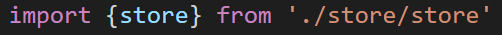

# VUEX
#### 什么是vuex
    Vuex 是一个专为 Vue.js 应用程序开发中管理的一个模式。

    通过创建一个集中的数据存储，方便程序中的所有组件进行访问


    思考:
        传统vue是单向数据流。如果是兄弟组件之间传值兄弟组件间的状态传递无能为力
        我们经常会采用父子组件通过正向/逆向传值来对数据进行传递。以上的这些模式非常脆弱，通常会导致无法维护的代码。
        vuex只能用于单个页面中不同组件（例如兄弟组件）的数据流通。
#### 安装vuex

    npm install vuex --save

    配置vuex文件创建在src中创建store文件夹-->与store.js 

    单一状态树：
        Vuex 使用单一状态——用一个对象就包含了全部的应用层级状态。
        至此它便作为一个“唯一数据源 ”而存在。这也意味着，每个应用将仅仅包含一个 store 实例。 

##### 创建store实例：
```js

import Vue from 'vue'
import Vuex from 'vuex'

Vue.use(Vuex)

export default new Vuex.Store({
    state: {
        },
mutations: {
    },
actions: {
    },
modules: {
    }
})

```
### 1. vuex--State数据源
vuex中的数据源state，我们需要保存的数据就保存在这里


##### vuex--使用数据源
    要使用首先在main.js引入vuex。
    一对大括号的原因是，指定要从其他模块导入的变量名。



1.可以使用$store.state.xx调用
```js
{{$store.state.text}}

mounted(){
    console.log(this.$store.state.text)
}
```
2.使用数据的组件中使用计算属性调用
this.$store.state.xxx
```js
computed(){
    obj(){
        return this.$store.state.obj
    }
}
```
##### vuex--state扩展知识点
    一、Vuex就是一个仓库，仓库里面放了很多对象。其中state
    就是数据源存放地，对应于与一般Vue对象里面的data

    二、state里面存放的数据是响应式的，Vue组件从store中读
    取数据，若是store中的数据发生改变，依赖这个数据的组件也会发生更新

    三、它通过mapState把全局的 state 和 getters 映射到当
    前组件的 computed 计算属性中

### 2. Getters
##### vuex--Getters属性
    getters相当于之前组件中学习的计算属性,getters属性主要
    是对于state中数据的一种过滤

    使用场景：在项目开发中，有时候希望对state中的某个属性
    在多个组件中展示出不同状态


##### vuex--使用Getters数据
    与使用state相同,在组件中的计算属性当中使用 
    this.$store.getters.xxx来进行调用

```js
newtextobj(){
    return this.$store.getters.newdataobj
}
```
##### vuex--Getters扩展知识点
    vuex的Getter特性是？
        一、getters 可以对State进行计算操作，它就是Store的计算属性
        二、 虽然在组件内也可以做计算属性，但是getters 可以在多组件之间复用
        三、 如果一个状态只在一个组件内使用一次或者使用了多次但是展示的形态相同，是可以不用getters

### 3.Mutations
#### vuex--Mutations
    mutations,里面装着一些改变数据方法的集合，就是把处理
    数据逻辑方法全部放在mutations里面（当触发事件的时候想
    改变state数据的时候使用mutations）


    注意：不能直接调用一个 mutations 中的处理函数 要使用
    this.$store.commit() 来进行调用。


##### vuex--Mutations  提交载荷（Payload）
    之前的只是一个简单的修改state中的属性

    在实际项目中往往会有值传递给Mutations  给store.commit传一个附加参数，他就叫做mutation的载荷
---
```js
<button @click="fun(i)>修改</button>

funa(num){
    this.$store.commit("uptwo",num)
}


mutations:{
    uptwo(state,payload){
        state.arr.foeach((v,i)=>{
            if(i==payload){
                state.arr[i].title = "ojbj"
            }
        })
    }
}

```
    多个参数也可以传递一个对象

    this.$store.commit('add', { 'num': 20 } )
### ****vuex--Mutations  问题
>vuex中页面刷新数据丢失问题
使用vue进行开发的过程中，状态管理工具一般使用vuex进行管理。但是修改后的vuex数据存储在内存中，所以当前页面刷新数据会产生丢失现象
使用H5特性本地存储
---
解决：
```js
created () {
    //在页面加载时读取localStorage里的状态信息
    if (localStorage.getItem("data") ) {
        //replaceState替换数据 Object.assign合并对象
        this.$store.replaceState(Object.assign({}, this.$store.state,JSON.parse(localStorage.getItem("data"))))
    } 
    //在页面刷新时将vuex里的信息保存到localStorage里
    window.addEventListener("beforeunload",()=>{
        localStorage.setItem("data",JSON.stringify(this.$store.state))
    })
},

```
### 4. Actions
#### vuex--Actions
Actions 进行操作，使用Actions 进行异步操作（异步请求） 
```js
actions:{
    actionfun(context){
        //调用mutatons中的方法
        context.commit(dataup)
    }
}
```

分发 Action：Action 通过 this.$store.dispatch("xxxx");方法触发 
```js
this.$store.dispatch("actionfun")
```

##### vuex--Actions 载荷（Payload）
Action同样支持载荷

```js
<button @click="funb(i)>修改2</button>

funa(num){
    this.$store.dispatch("act",num)
}


actions:{
    act(context,payload){
        context.commit("uptwo",payload)
    }
}
```
##### vuex--Actions总结
    Actions可以理解为通过将mutations里面处里数据的方法变成
    可异步的处理数据的方法，简单的说就是异步操作数据（但是还
    是通过mutation来操作，因为只有它能操作）

### 5. modules
#### vuex--modules
    在Vue中State使用是单一状态树结构，应该的所有的状态都放在state里面，
    如果项目比较复杂，那state是一个很大的对象，store对象也将对变得非常大，难于管理。

    module：可以让每一个模块拥有自己的state、mutation、action、getters,
    使得结构非常清晰，方便管理。
---
>创建文件容纳模块
>>

>在vuex中引用模块
>>

>使用数据：$store.state.模块名.xxx
>>

>修改数据：和没有modules的时候一样。
>>add(){
    this.store.commit("add")
}
>>>mutations:{
    add(state){
        state.text += "sdgsg";
    }
}